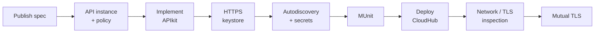

# MuleSoft Hands-On: AnyAirline Check-In PAPI

A learn-and-implement repo. **Read the concept, then do the lab.** Every lab links back to the concept files it needs, has slots for your real screenshots, and ends with a verify + self-check.

> Scenario: AnyAirline's mobile app calls **Check-In PAPI** (`PUT /tickets/{PNR}/checkin`), which talks to on-prem **Flights Management** (SOAP, mutual TLS) and **Passenger Data** (PostgreSQL). Design & publish are already done; we **develop, test, secure and deploy** it.



## 🧭 How to use it

1. Start with [concepts/00-learning-path.md](concepts/00-learning-path.md) (sequence, gaps, connecting concept).
2. For each lab below: **📖 read concept → 🛠 do lab → 📸 drop screenshot → ☑ tick**.
3. Generate general images and placeholders:
   ```bash
   bash scripts/download_images.sh          # fills images/general from images/manifest.csv
   pip install pillow && python3 scripts/make_placeholders.py   # grey TODO boxes for missing screenshots
   ```
   Then overwrite each placeholder with your real screenshot **using the same file name**.

## 🛠 Hands-on labs (main path)

| ☑ | Lab | 📖 Read first | You will |
|---|---|---|---|
| ☐ | [Lab 01 Publish spec](labs/lab-01-publish-spec.md) | [03](concepts/03-design-first-raml-oas.md), [04](concepts/04-exchange-mocking.md) | Import spec, create envs, publish to Exchange |
| ☐ | [Lab 02 API instance & policy](labs/lab-02-api-instance-policy.md) | [05](concepts/05-api-manager-policies.md) | Register API, logging + client-ID policy |
| ☐ | [Lab 03 Implement with APIkit](labs/lab-03-implement-apikit.md) | [10](concepts/10-apikit-flow-design.md), [11](concepts/11-dataweave-basics.md), [12](concepts/12-error-handling.md) | Scaffold flows, DataWeave, error handling |
| ☐ | [Lab 04 Keystore & HTTPS](labs/lab-04-keystore-https.md) | [09](concepts/09-tls-certificates.md) | keytool, TLS context, HTTPS listener |
| ☐ | [Lab 05 Autodiscovery & secrets](labs/lab-05-autodiscovery-secure-props.md) | [13](concepts/13-properties-secrets.md), [06](concepts/06-autodiscovery.md) | Per-env config, encrypted props, link to API Manager |
| ☐ | [Lab 06 MUnit](labs/lab-06-munit.md) | [14](concepts/14-munit-testing.md) | Tests + coverage |
| ☐ | [Lab 07 Deploy to CloudHub](labs/lab-07-deploy-cloudhub.md) | [15](concepts/15-deploy-operate.md), [07](concepts/07-networking-cloudhub.md) | Deploy, verify policies, analytics |
| ☐ | [Lab 08 Network & TLS inspection](labs/lab-08-network-tls-checks.md) | [07](concepts/07-networking-cloudhub.md), [08](concepts/08-vpc-onprem-targets.md) | nslookup, openssl, plan VPC |
| ☐ | [Lab 09 Mutual TLS](labs/lab-09-mutual-tls.md) | [09](concepts/09-tls-certificates.md) | Require client certificate |
| ☐ | [Lab 10 CloudHub 1.0 custom domain](labs/lab-10-cloudhub1-custom-domain.md) | [16](concepts/16-cloudhub-rtf-deployment-targets.md) | CA-signed cert, DLB/Certificates upload, CNAME |
| ☐ | [Lab 11 CloudHub 2.0 Private Space](labs/lab-11-cloudhub2-private-space.md) | [16](concepts/16-cloudhub-rtf-deployment-targets.md) | Private Space, firewall rules, static IP |
| ☐ | [Lab 12 RTF Ingress + TLS](labs/lab-12-rtf-ingress-tls.md) | [16](concepts/16-cloudhub-rtf-deployment-targets.md) | Kubernetes Secret, Ingress resource, TLS termination choice |
| ☐ | [Lab 13 Coding conventions](labs/lab-13-coding-conventions.md) | [17](concepts/17-coding-conventions.md) | Extract to flow, naming check, formatter, MUnit re-run |
| ☐ | [Lab 14 Maven parameterize & deploy](labs/lab-14-maven-parameterize-deploy.md) | [18](concepts/18-maven-build.md), [13](concepts/13-properties-secrets.md) | mule-maven-plugin, `mvn deploy -DmuleDeploy` |

## 📚 Concept index

| # | Concept |
|---|---|
| 00 | [Learning path & gaps](concepts/00-learning-path.md) |
| 01 | [API lifecycle](concepts/01-api-lifecycle.md) |
| 02 | [REST & Richardson](concepts/02-rest-richardson.md) |
| 03 | [Design-first, RAML vs OAS](concepts/03-design-first-raml-oas.md) |
| 04 | [Exchange & mocking](concepts/04-exchange-mocking.md) |
| 05 | [API Manager, policies, gateways](concepts/05-api-manager-policies.md) |
| 06 | [Autodiscovery](concepts/06-autodiscovery.md) |
| 07 | [Networking on CloudHub](concepts/07-networking-cloudhub.md) |
| 08 | [VPC, on-prem, deployment targets](concepts/08-vpc-onprem-targets.md) |
| 09 | [TLS & certificates](concepts/09-tls-certificates.md) |
| 10 | [APIkit & flow design](concepts/10-apikit-flow-design.md) |
| 11 | [DataWeave basics](concepts/11-dataweave-basics.md) |
| 12 | [Error handling](concepts/12-error-handling.md) |
| 13 | [Properties & secrets](concepts/13-properties-secrets.md) |
| 14 | [MUnit testing](concepts/14-munit-testing.md) |
| 15 | [Deploy & operate](concepts/15-deploy-operate.md) |
| 16 | [CloudHub 1.0 vs 2.0 vs RTF](concepts/16-cloudhub-rtf-deployment-targets.md) |
| 17 | [Coding conventions, DRY & naming](concepts/17-coding-conventions.md) |
| 18 | [Maven build fundamentals](concepts/18-maven-build.md) |

## 🗂 Structure

```
concepts/    theory + Mermaid diagrams (read first)
labs/        step-by-step practicals with screenshot slots
samples/     RAML, Mule XML, DataWeave, MUnit, config templates
images/      general/ (downloaded), screenshots/ (yours), diagrams/ (yours)
scripts/     download_images.sh, make_placeholders.py
```

## 🔐 Rules
- Never commit real keystores, passwords, client secrets (see `.gitignore`).
- Passwords in this repo are placeholders. Use your own.
- Mermaid diagrams render on GitHub; for your own diagrams save PNGs in `images/diagrams/`.

## ⚠ Verify against your versions
Some XML (TLS mutual auth, secure-properties, autodiscovery namespaces) varies by Mule runtime and connector versions. Treat `samples/` as starting points and check current MuleSoft docs.
