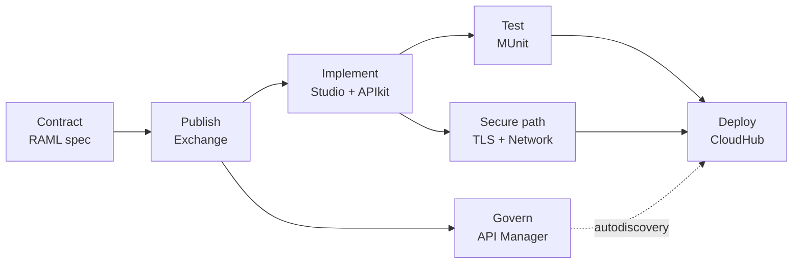

# 00 · Learning Path, Connecting Concept & Gaps

> The original AnyAirline deck is **out of order** (slides 10, 11, 9, 12, 14, 16 …) and stops before the code is written and tested. This page fixes the order and shows what was added.

## The connecting concept

**One API contract (RAML) drives everything.**

Every later step *reuses* the contract: APIkit scaffolds from it, MUnit asserts against it, API Manager applies policies to it, and TLS/networking protect the path consumers use to reach it.

## Correct sequence (deck slide → module)

| # | Module (read first) | Deck slides | Then do |
|---|---|---|---|
| 1 | [01 API Lifecycle](01-api-lifecycle.md) | Lifecycle, scope | – |
| 2 | [02 REST & Richardson](02-rest-richardson.md) | 9 | – |
| 3 | [03 Design-First, RAML vs OAS](03-design-first-raml-oas.md) | 10, 11 | – |
| 4 | [04 Exchange & Mocking](04-exchange-mocking.md) | 12 | [Lab 01](../labs/lab-01-publish-spec.md) |
| 5 | [05 API Manager, Policies, Gateways](05-api-manager-policies.md) | 14, 16, 17 | [Lab 02](../labs/lab-02-api-instance-policy.md) |
| 6 | [10 APIkit & Flow Design](10-apikit-flow-design.md) *(added)* | – | [Lab 03](../labs/lab-03-implement-apikit.md) |
| 7 | [11 DataWeave](11-dataweave-basics.md) *(added)* | – | Lab 03 |
| 8 | [12 Error Handling](12-error-handling.md) *(added)* | – | Lab 03 |
| 9 | [09 TLS & Certificates](09-tls-certificates.md) | 29, 30, 34, 33, 36 | [Lab 04](../labs/lab-04-keystore-https.md) |
| 10 | [13 Properties & Secrets](13-properties-secrets.md) *(added)* | 18 (partly) | [Lab 05](../labs/lab-05-autodiscovery-secure-props.md) |
| 11 | [06 Autodiscovery](06-autodiscovery.md) | 18 | Lab 05 |
| 12 | [14 MUnit Testing](14-munit-testing.md) *(added, promised in scope)* | – | [Lab 06](../labs/lab-06-munit.md) |
| 13 | [07 Networking on CloudHub](07-networking-cloudhub.md) | 20–22, 25 | [Lab 08](../labs/lab-08-network-tls-checks.md) |
| 14 | [08 VPC, On-Prem, Deployment Targets](08-vpc-onprem-targets.md) | 23, 24, 27 | Lab 08 |
| 15 | [15 Deploy & Operate](15-deploy-operate.md) *(added)* | 35 step 5 | [Lab 07](../labs/lab-07-deploy-cloudhub.md), [Lab 09](../labs/lab-09-mutual-tls.md) |
| 16 | [16 CloudHub 1.0 vs 2.0 vs RTF](16-cloudhub-rtf-deployment-targets.md) *(added)* | – | [Lab 10](../labs/lab-10-cloudhub1-custom-domain.md), [Lab 11](../labs/lab-11-cloudhub2-private-space.md), [Lab 12](../labs/lab-12-rtf-ingress-tls.md) |
| 17 | [17 Coding Conventions, DRY & Naming](17-coding-conventions.md) *(added)* | – | [Lab 13](../labs/lab-13-coding-conventions.md) |
| 18 | [18 Maven Build Fundamentals](18-maven-build.md) *(added)* | 35 step 5 | [Lab 14](../labs/lab-14-maven-parameterize-deploy.md) |

> Why TLS comes before autodiscovery: the walkthrough (slide 35) builds HTTPS *before* registering with API Manager, and autodiscovery needs the secured app to start cleanly.

## Missing concepts I added

| Gap in deck | Added in |
|---|---|
| APIkit router, validation, flow naming | 10 |
| DataWeave (the actual transformation logic) | 11 |
| Error handling / status-code mapping | 12 |
| Secure properties, per-environment config | 13 |
| MUnit (deck says scope = Develop + Test but never covers it) | 14 |
| Client ID enforcement (deck mentions it in one line) | 05 |
| Runtime Manager deploy, logs, CI/CD, monitoring | 15 |
| CloudHub 1.0 vs 2.0 vs RTF networking/TLS differences | 16 |
| DRY, naming conventions, formatting/lint | 17 |
| Maven lifecycle, dependency management, CI/CD deploy from the command line | 18 |

## Accuracy notes on the deck (check against your versions)

- Slide 28 says Mule 4 supports TLS 1.1 and 1.2. Current runtimes default to **TLS 1.2 (1.3 on newer versions)**; 1.0/1.1 are disabled. Check your runtime's release notes.
- "Flex Gateway" was renamed **Omni Gateway** in Anypoint; docs may still use the old name.
- CloudHub 1.0 vs 2.0 terminology differs (VPC vs private space); make sure you know which one your org uses.
