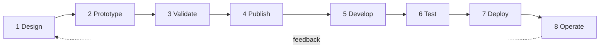
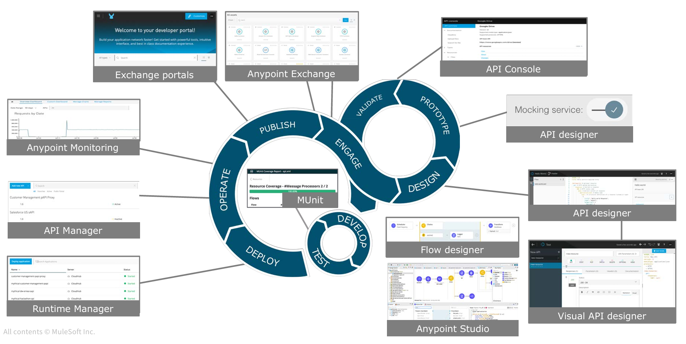
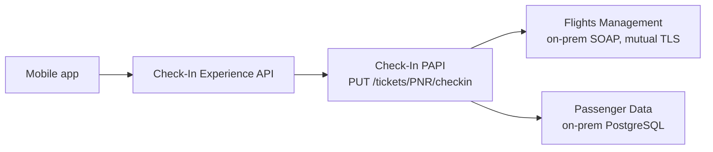

# 01 · The Full API Lifecycle

**Goal:** know where each Anypoint tool fits, and which part this repo covers.

## The 8 phases

| Phase     | Tool                         | What you do                     |
| --------- | ---------------------------- | ------------------------------- |
| Design    | API Designer (Design Center) | Write the RAML/OAS contract     |
| Prototype | Mocking Service              | Live mock before any code       |
| Validate  | API Console                  | Consumers give feedback on spec |
| Publish   | Exchange & API Portals       | Discoverable assets + docs      |
| Develop   | Anypoint Studio              | Build Mule apps                 |
| Test      | MUnit                        | Unit + integration tests        |
| Deploy    | Runtime Manager              | CloudHub / on-prem              |
| Operate   | API Manager & Analytics      | Policies, SLAs, monitoring      |

## Scope of this repo

The AnyAirline APIs are **already designed and published**, so we focus on **Develop + Test**, plus the surrounding pieces you need to make that real (publish walkthrough, governance, TLS, networking, deploy).

## AnyAirline system landscape

**Next →** [02 REST & Richardson](02-rest-richardson.md)
