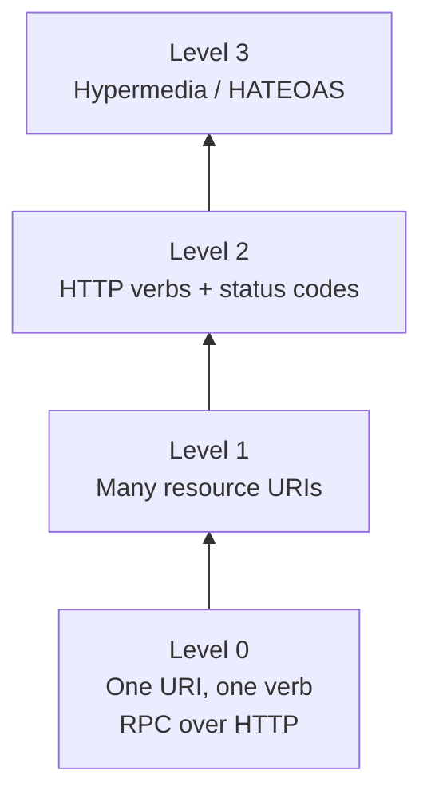

# 02 · REST in a Nutshell (Richardson Maturity Model)

## Four levels

| Level | Idea | Example |
|---|---|---|
| 0 | One endpoint, one verb | `POST /service` with action in body |
| 1 | Resources get URIs | `/tickets/ABC123` |
| 2 | Right verb + status code | `PUT /tickets/ABC123/checkin` → `200`/`404` |
| 3 | Responses carry links | `"links":[{"rel":"boardingpass",...}]` |

**AnyAirline target = Level 2.** Hypermedia is not used.

## Verbs & status codes you'll use

| Verb | Meaning | Success | Typical errors |
|---|---|---|---|
| GET | Read | 200 | 404 |
| POST | Create | 201 | 400, 409 |
| PUT | Replace / idempotent action | 200/204 | 400, 404 |
| PATCH | Partial update | 200 | 400, 404 |
| DELETE | Remove | 204 | 404 |

Also: `401` unauthenticated, `403` forbidden, `429` rate-limited (SLA policy), `500`/`502`/`503` server side.

**← Back** [01](01-api-lifecycle.md) · **Next →** [03 Design-First](03-design-first-raml-oas.md)
