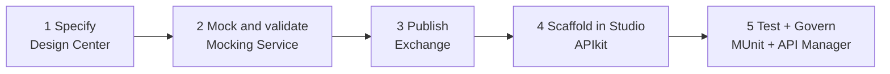
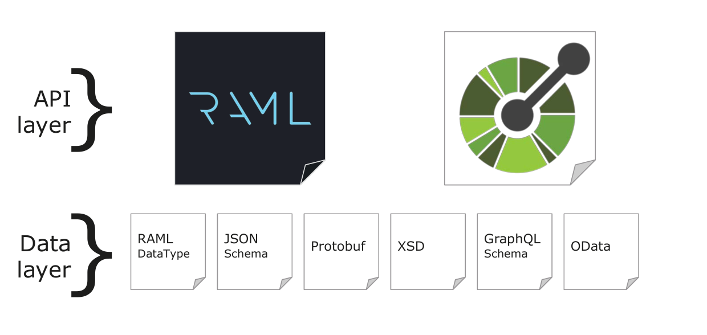
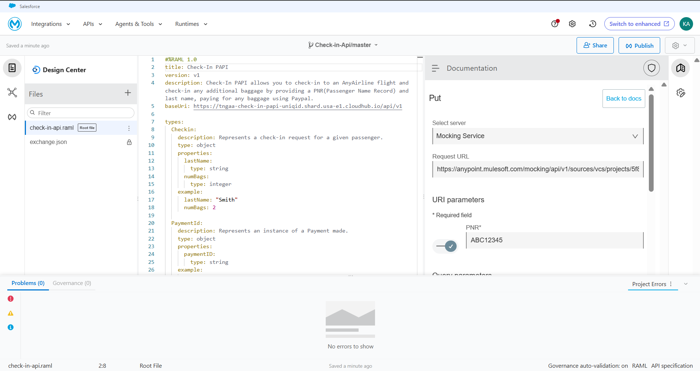

# 03 · Design-First & Spec Languages (RAML vs OAS)

## Design-first flow



Why: changes are cheap while there's only a contract. Mobile team and partners can call the **mock** before a single flow exists.



## RAML 1.0 vs OAS

|                   | RAML 1.0 (used by AnyAirline)                 | OAS (Swagger / 2.0, 3.x)      |
| ----------------- | --------------------------------------------- | ----------------------------- |
| Format            | YAML                                          | YAML or JSON                  |
| Reuse             | `!include`, libraries, traits, resource types | Fewer include mechanisms      |
| Size as API grows | Stays modular                                 | Files tend to grow            |
| Ecosystem         | Anypoint tooling is first-class               | Huge industry adoption        |
| In Anypoint       | Native in Design Center                       | OAS 2.0 supported; importable |

-> [RAML](C:\Users\kumar\Desktop\mulesoft-anyairline-hands-on\samples\raml\RAML.txt)

-> [Step-by-step workflow to design RAML](C:\Users\kumar\Desktop\mulesoft-anyairline-hands-on\samples\raml\Step-by-step-workflow-to-design-RAML.txt)

## Minimal RAML (full file: `samples/raml/check-in-papi.raml`)

```yaml
#%RAML 1.0
title: Check-In PAPI
version: v1
baseUri: https://api.anyairline.com/checkin/{version}
types:
  CheckInResult:
    properties:
      pnr: string
      status: string
/tickets/{PNR}/checkin:
  put:
    responses:
      200:
        body:
          application/json:
            type: CheckInResult
      404:
        body:
          application/json:
            example: { "message": "PNR not found" }
```

Key parts: **resources**, **methods**, **types**, **examples**, **securitySchemes**, **libraries** (`checkin`, `paymentid`, `boardingpass` from Exchange).



**← Back** [02](02-rest-richardson.md) · **Next →** [04 Exchange](04-exchange-mocking.md)
