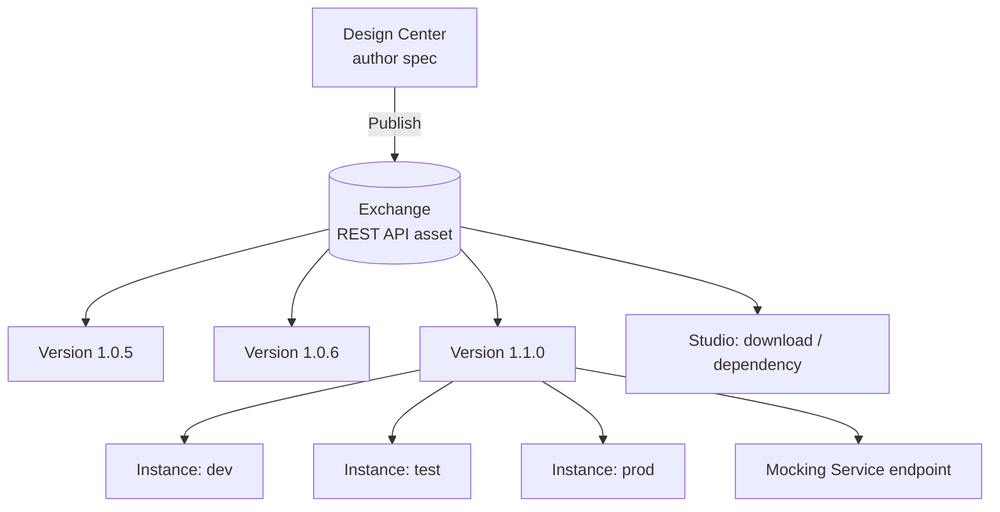
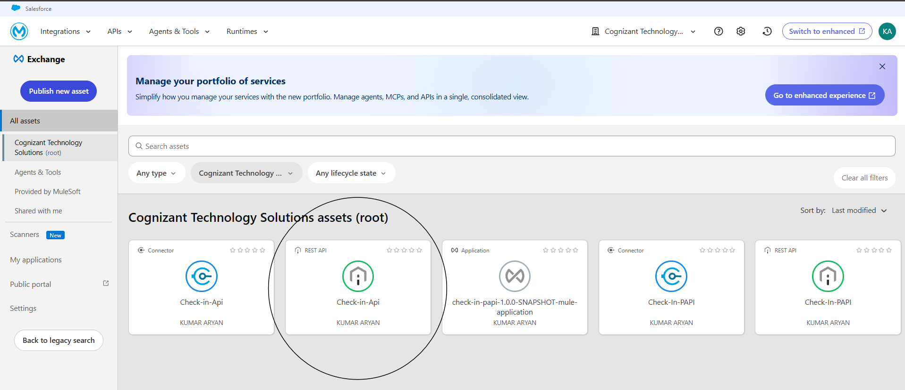
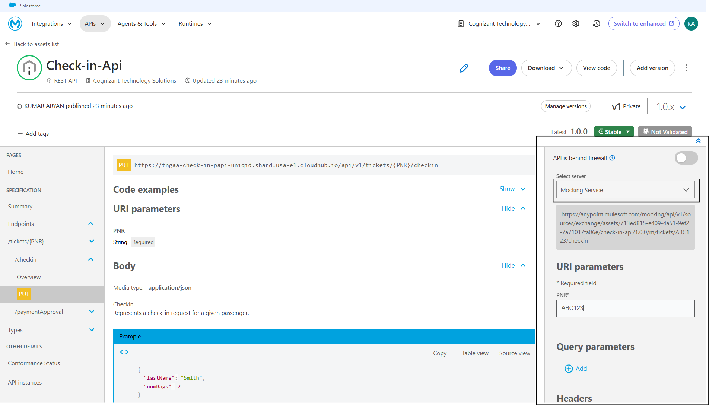

# 04 · Anypoint Exchange & Mocking Service

Exchange is the **asset catalog**: APIs, connectors, templates, RAML fragments. It becomes the single source of truth for consumers.

## What Exchange gives you

| Feature         | Meaning for AnyAirline                                                                                 |
| --------------- | ------------------------------------------------------------------------------------------------------ |
| Versions        | 1.0.5 → 1.0.6 → 1.1.0, each tracked                                                                    |
| Instances       | Which env (dev/test/prod) runs which version                                                           |
| Live docs       | `PUT /tickets/{PNR}/checkin` browsable with types/examples                                             |
| Mocking         | Call the spec before code exists                                                                       |
| Metadata        | Type, org, author, publish date, visibility (private)                                                  |
| Reuse           | Libraries (`checkin`, `paymentid`, `boardingpass`) imported by other specs; Studio downloads the asset |
| Ratings/reviews | Consumer feedback                                                                                      |

## Semantic versioning cheat-sheet

- **Patch** (1.0.5→1.0.6): doc/example fix, no contract change
- **Minor** (1.0.x→1.1.0): backwards-compatible addition
- **Major** (→2.0.0): breaking change → new API version and instance

**Do it →** [Lab 01](../labs/lab-01-publish-spec.md) · **← Back** [03](03-design-first-raml-oas.md) · **Next →** [05](05-api-manager-policies.md)
