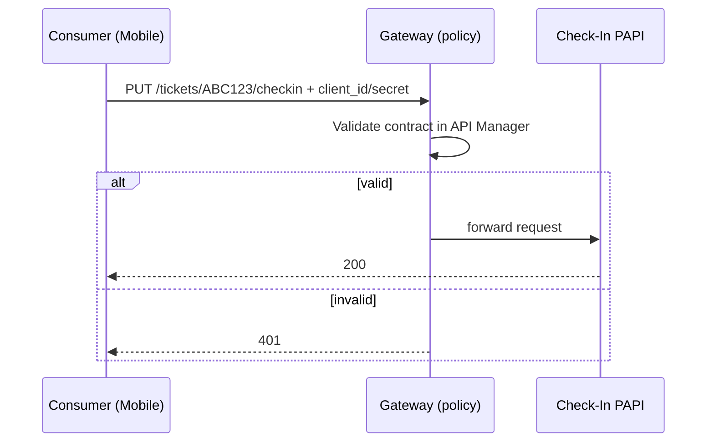
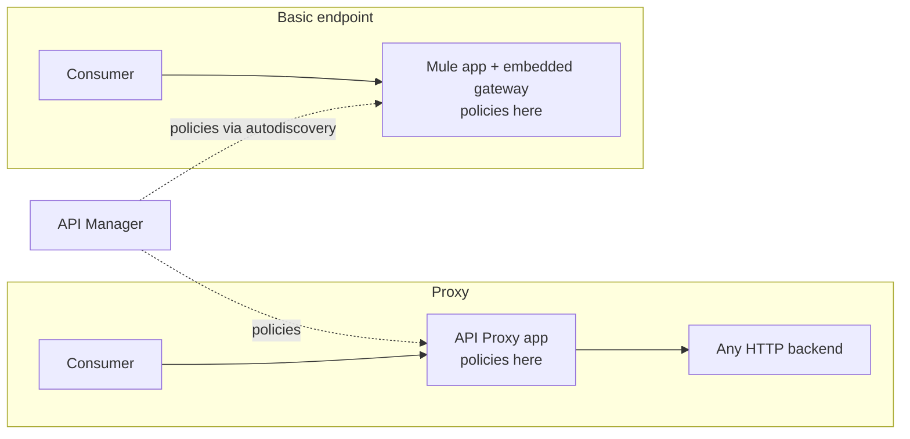
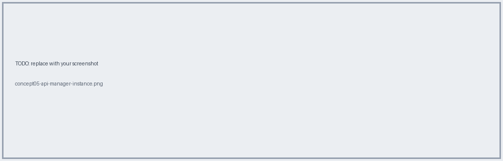

# 05 · API Manager, Policies, Gateways & Enforcement Patterns

## What it is

API Manager **registers an API instance**, applies **policies** (non-functional rules), and Analytics reports traffic. It works at the **HTTP layer**: HTTP/1.x REST, SOAP, generic HTTP. **Not** WebSocket or HTTP/2.

Because RAML/OAS lists every resource and method, policies can be scoped **per resource** (e.g. only `PUT /tickets/{PNR}/checkin`), in addition to endpoint-level policies.

## Common policies

| Policy | Purpose |
|---|---|
| Client ID Enforcement | Caller must send `client_id` / `client_secret` from a contract |
| Rate limiting / SLA tiers | Cap calls, return `429` |
| Message logging | Audit trail (automated policy = applied to all APIs in env) |
| IP allowlist | Restrict networks |
| JWT / OAuth | Token-based identity |

**Client ID enforcement flow**

## Who enforces? (Gateway runtime per API instance)

| Gateway | Runs | Use when |
|---|---|---|
| **Mule Gateway** (default) | Embedded in the Mule runtime | Mule apps, widest policy set incl. resource-level |
| **Omni Gateway** (was Flex) | Envoy-based standalone: Linux/Docker/K8s | Non-Mule APIs, ingress; also LLM/MCP/agent traffic |
| **Service Mesh** | Istio sidecars | Microservices in Kubernetes |

## Proxy vs Basic Endpoint

| | Proxy | Basic endpoint |
|---|---|---|
| Backend | Any (non-Mule ok) | Must be Mule app |
| Extra worker | Yes | No |
| Policy delivery | Proxy app | Downloaded at runtime to the app |

**AnyAirline:** Check-In PAPI uses **basic endpoint**; proxies front the non-Mule Flights Management and Passenger Data systems.

**Do it →** [Lab 02](../labs/lab-02-api-instance-policy.md) · **Then** [06 Autodiscovery](06-autodiscovery.md) · **← Back** [04](04-exchange-mocking.md)
