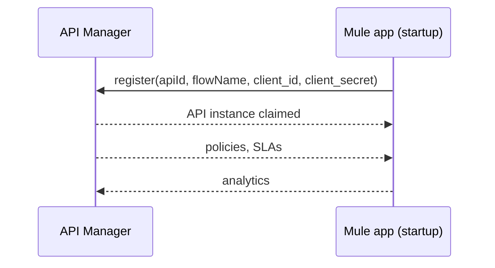
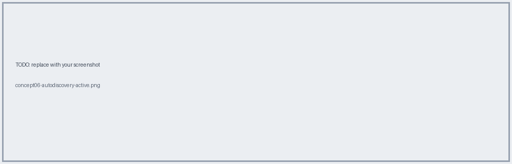

# 06 · API Autodiscovery

**Problem:** your Mule app is running; how does API Manager know *this* app is *that* API instance so it can push policies?

**Answer:** the **API ID** + organization **client credentials**.



## Two ingredients

1. **API ID** – created when the API instance is created in API Manager (per environment).
2. **Org credentials** – Client ID + Secret from Access Management (Environment level), passed as **properties**, never hardcoded.

## Config

```xml
<api-gateway:autodiscovery apiId="${api.id}" flowRef="check-in-papi-main" doc:name="API Autodiscovery"/>
```

```properties
# per-environment (dev/test/prod each have own credentials + api.id)
api.id=<your-api-id>
anypoint.platform.client_id=<secure value>
anypoint.platform.client_secret=<secure value>
```

`flowRef` = the **APIkit main flow name** (the one with the HTTP listener).

## Troubleshooting

| Symptom | Likely cause |
|---|---|
| Instance shows "Unregistered" | wrong `api.id`, wrong env credentials |
| Policies never apply | flowRef points at wrong flow |
| 401 on startup logs | credentials for the wrong environment |



**Do it →** [Lab 05](../labs/lab-05-autodiscovery-secure-props.md) · **Needs** [13 Properties](13-properties-secrets.md)
