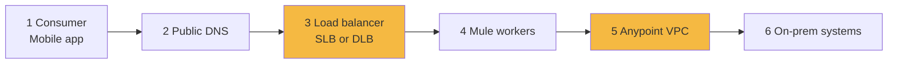
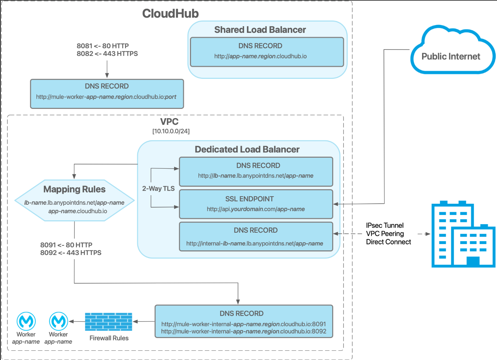

# 07 · Networking on CloudHub

## The six hops



You configure the highlighted ones (LB, VPC). Mental model: **inbound = DNS + LB + TLS; internal = VPC; outbound to on-prem = VPN/peering/hybrid**.

## Ports & DNS

| Item                 | Value                                         |
| -------------------- | --------------------------------------------- |
| Worker HTTP / HTTPS  | `${http.port}`=8081 / `${https.port}`=8082    |
| LB public            | 80 / 443 forwarded to worker ports            |
| Direct worker access | 8091 / 8092                                   |
| App name             | `myapp.us-e1.cloudhub.io` → **load balancer** |
| Worker public        | `mule-worker-myapp.cloudhub.io`               |
| Worker VPC-internal  | `mule-worker-internal-myapp.cloudhub.io`      |

**Golden rule:** bind listener to `0.0.0.0` + `${http.port}`/`${https.port}`. Never hardcode `8081` or `localhost`.

```xml
<http:listener-config name="HTTP_Listener_config">
  <http:listener-connection host="0.0.0.0" port="${http.port}"/>
</http:listener-config>
```

## Shared vs Dedicated Load Balancer

|                                     | SLB                            | DLB                                     |
| ----------------------------------- | ------------------------------ | --------------------------------------- |
| Cost                                | Free, default, one per region  | Licensed add-on                         |
| Needs VPC                           | No                             | **Yes**                                 |
| Hostname                            | `app.region.cloudhub.io` fixed | Custom domain (`api.anyairline.com`)    |
| Certificates                        | MuleSoft only                  | Yours; mutual TLS                       |
| URL mappings                        | No                             | Yes (`/checkin` → `check-in-papi:8092`) |
| Allowlists / TLS versions / ciphers | No                             | Yes                                     |
| Isolation                           | Shared with tenants            | Yours                                   |

**AnyAirline:** SLB for dev/test; **DLB in prod** for `api.anyairline.com`, mutual TLS with the mobile app certificate, and CIDR allowlists for partners.

## Outbound traffic

- No VPC → shared IP pool (hard to allowlist)
- With VPC → predictable egress, allowlistable
- App-to-app inside VPC → use `mule-worker-internal-…` (avoid hairpin via public LB)




**Do it →** [Lab 08](../labs/lab-08-network-tls-checks.md) · **Next →** [08 VPC & On-Prem](08-vpc-onprem-targets.md)
