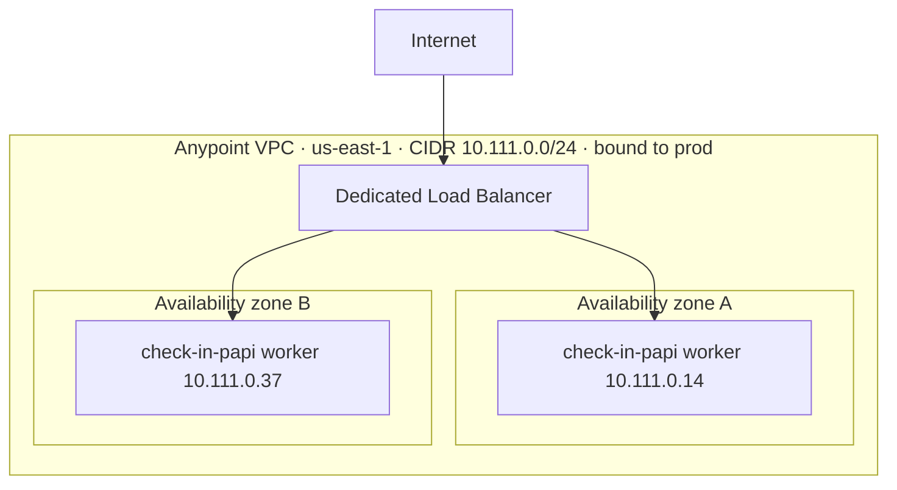
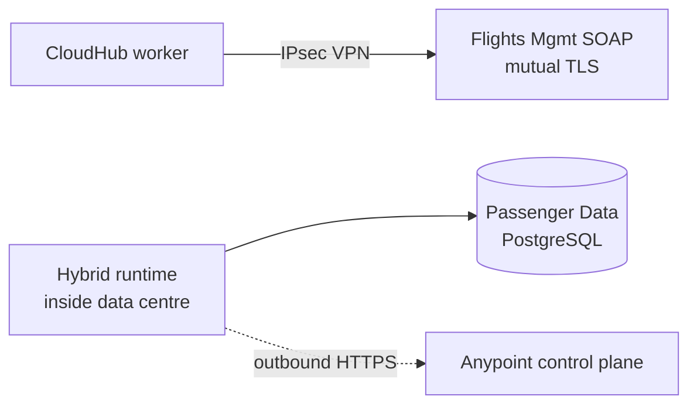
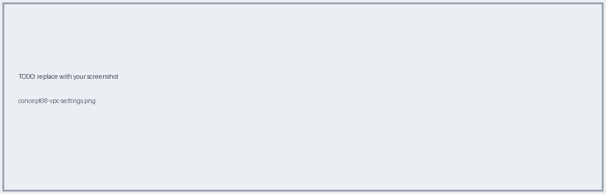

# 08 · VPC, On-Prem Connectivity & Deployment Targets

## Anypoint VPC anatomy

- **CIDR** (/16 to /24): each worker consumes an IP; size for peak + headroom. **Cannot be resized**, must **not overlap** corporate ranges.
- **Firewall rules**: per source CIDR + port. Defaults are wide open on 8081/8082, so tighten to LB + internal ranges.
- **Binding**: one region per VPC, associated with chosen environments.

## Reaching on-prem (3 options)

| Option | How | Pick when |
|---|---|---|
| IPsec site-to-site VPN | Self-service in Runtime Manager; needs public IP on your side + static routes/BGP | Most on-prem calls; fastest |
| VPC peering / Direct Connect | Requested via MuleSoft support | Sustained, latency-sensitive volume |
| Hybrid Mule runtime | Runtime in your data centre; only outbound HTTPS to control plane | System must never be exposed (Passenger Data PostgreSQL) |

## Where it runs

| | CloudHub 1.0 | CloudHub 2.0 | Runtime Fabric / hybrid |
|---|---|---|---|
| Network isolation | Anypoint VPC | Private space | Your own network |
| Entry point | SLB or DLB | Ingress in private space (your cert, no separate LB licence) | You own ingress |
| Unit | Sized worker | Replica (container) | Your K8s / servers |
| On-prem | VPN / peering / DX | VPN / transit gateway on private space | Already inside |

**AnyAirline blueprint:** Check-In PAPI on CloudHub (isolated network, DLB on `api.anyairline.com`, mutual TLS); IPsec VPN to the data centre; hybrid runtime beside PostgreSQL Passenger Data.

**← Back** [07](07-networking-cloudhub.md) · **Next →** [09 TLS](09-tls-certificates.md)
