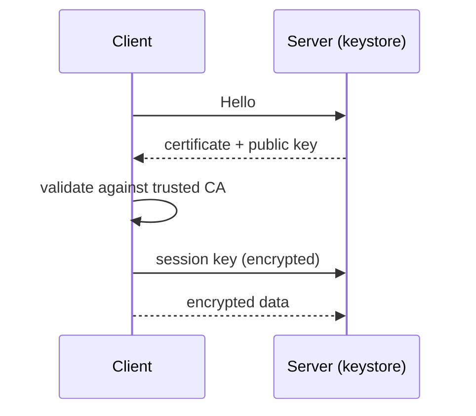
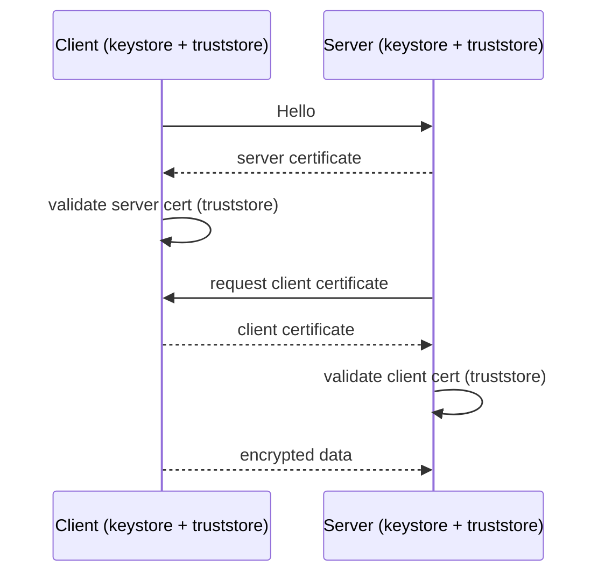
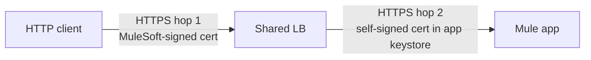

# 09 · TLS, Certificates, Keystores & Truststores

## Core idea

**Certificates give identity. Key pairs give confidentiality.** A certificate publishes the public key and vouches for the owner; only the matching private key can decrypt. The session key that encrypts the actual traffic is agreed after identity is proven.

## What is in a certificate

- Public key (never the private key)
- Subject (organization details, CN, SAN)
- Issuer, validity dates, issuer's signature

**Who signs:** a trusted **CA** (clients already trust it) or **self-signed** with `keytool` (fine for dev/test; must be added to every caller's truststore by hand).

**Validation chain:** server presents cert → client checks issuer signature against trusted CA list → identity accepted → session key agreed. Any broken link (untrusted, expired, name mismatch) = TLS error, not an application error.

## Keystore vs Truststore

| | Holds | Used for |
|---|---|---|
| **Keystore** | Your identity: private key + your certificate | Proving *who you are* |
| **Truststore** | CA / partner certificates you accept | Deciding *who you trust* |

## One-way TLS

Server is proven; client identity comes from a policy (e.g. client-id enforcement). Standard for public HTTPS (Check-In Experience API).

## Two-way (mutual) TLS

Extra: client also has a keystore, server needs a truststore with the client CA. Required by the **Flights Management SOAP** service. Cost: certificate distribution and rotation.

## Certificates on CloudHub (two hops)

Clients validate only hop 1, so a self-signed cert on the worker is acceptable. A **DLB** replaces hop-1 cert with yours on `api.anyairline.com`.

## Where TLS terminates (choose)

- LB terminates TLS, plain HTTP inside VPC: acceptable
- HTTPS listener on worker: when worker is reached directly or payload must stay encrypted end to end

## Mule TLS context

One global `tls:context`, referenced by HTTP listeners **and** requesters. Sets protocols, ciphers, and whether client auth is required. Keystore mandatory for server identity; truststore only for mutual TLS. Ship both as **secured resources**, and keep passwords in secure properties.

**Do it →** [Lab 04](../labs/lab-04-keystore-https.md) and [Lab 09](../labs/lab-09-mutual-tls.md) · **← Back** [08](08-vpc-onprem-targets.md)
