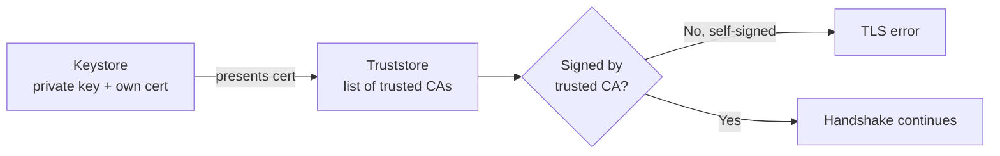
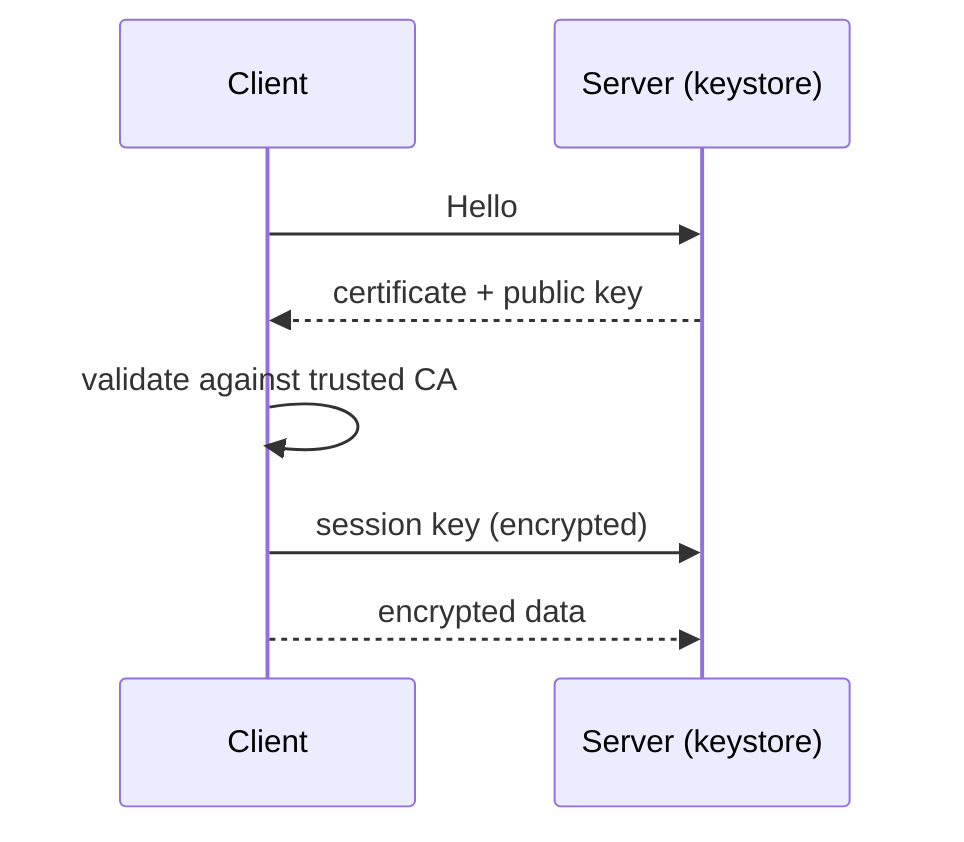
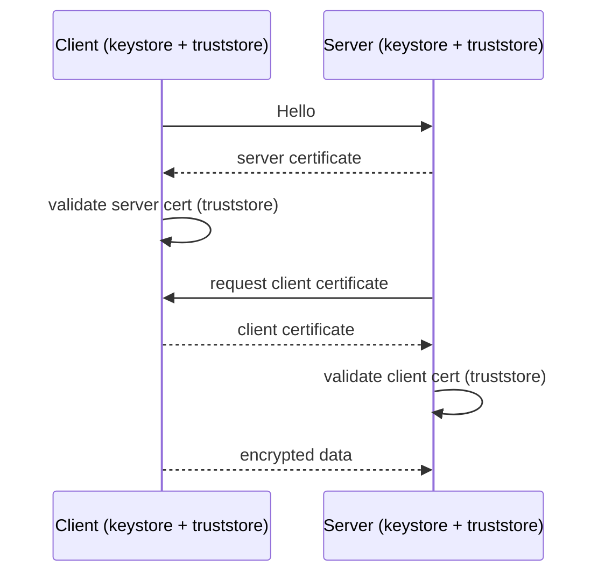
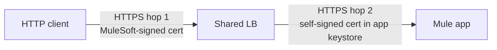
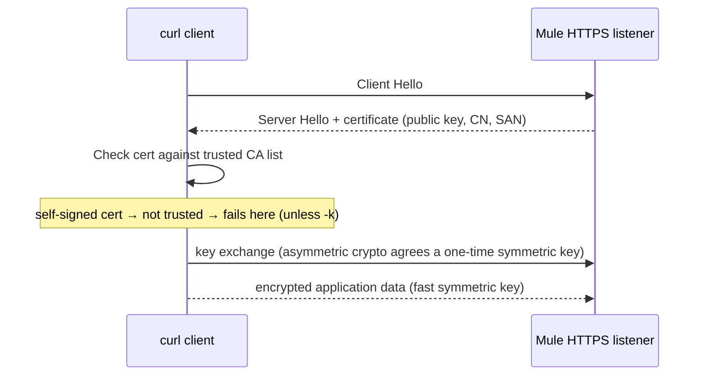

# 09 · TLS, Certificates, Keystores & Truststores

## Core idea

**Certificates give identity. Key pairs give confidentiality.** A certificate publishes the public key and vouches for the owner; only the matching private key can decrypt. The session key that encrypts the actual traffic is agreed after identity is proven.

## What is in a certificate

- Public key (never the private key)
- Subject (organization details, CN, SAN)
- Issuer, validity dates, issuer's signature

**Who signs:** a trusted **CA** (clients already trust it) or **self-signed** with `keytool` (fine for dev/test; must be added to every caller's truststore by hand).

**Validation chain:** server presents cert → client checks issuer signature against trusted CA list → identity accepted → session key agreed. Any broken link (untrusted, expired, name mismatch) = TLS error, not an application error.

## Keystore vs Truststore

| | Holds | Used for |
|---|---|---|
| **Keystore** | Your identity: private key + your certificate | Proving *who you are* |
| **Truststore** | CA / partner certificates you accept | Deciding *who you trust* |



## One-way TLS



Server is proven; client identity comes from a policy (e.g. client-id enforcement). Standard for public HTTPS (Check-In Experience API).

## Two-way (mutual) TLS



Extra: client also has a keystore, server needs a truststore with the client CA. Required by the **Flights Management SOAP** service. Cost: certificate distribution and rotation.

## Certificates on CloudHub (two hops)



Clients validate only hop 1, so a self-signed cert on the worker is acceptable. A **DLB** replaces hop-1 cert with yours on `api.anyairline.com`.

## Where TLS terminates (choose)

- LB terminates TLS, plain HTTP inside VPC: acceptable
- HTTPS listener on worker: when worker is reached directly or payload must stay encrypted end to end

## Mule TLS context

One global `tls:context`, referenced by HTTP listeners **and** requesters. Sets protocols, ciphers, and whether client auth is required. Keystore mandatory for server identity; truststore only for mutual TLS. Ship both as **secured resources**, and keep passwords in secure properties.

## Why `curl -k` "fixes" the untrusted-cert error

TLS does two separate jobs: **encryption** (nobody on the wire can read the traffic) and **authentication** (the client proves it's really talking to the real server, not a man-in-the-middle). `-k`/`--insecure` skips only the authentication check — it still encrypts, but no longer verifies who's on the other end.



Why the handoff: asymmetric crypto (RSA) lets two strangers agree a secret safely, but it's too slow for a whole conversation; symmetric crypto (AES) is fast but needs a shared key first. TLS uses asymmetric crypto **once**, only to hand over a one-time symmetric session key — like a locked box used once to pass a house key in public.

Fine for solo local dev against `localhost`. **Never acceptable in production** — it means your client (or Mule acting as a client) will accept any impostor's certificate, defeating the point of TLS entirely.

## keytool flags, decoded (`Lab 04` command)

```bash
keytool -v -genkeypair -keyalg RSA \
  -dname "CN=localhost, OU=Training, O=MuleSoft, C=US" \
  -ext "SAN=DNS:localhost,IP:127.0.0.1" \
  -validity 365 -alias server \
  -keystore check-in-papi-dev.p12 -storetype pkcs12 \
  -storepass "<choose-a-password>"
```

| Flag | Meaning |
|---|---|
| `-genkeypair` | Generates a new key pair **and** wraps the public key in a self-signed certificate |
| `-keyalg RSA` | Asymmetric algorithm used for the key pair |
| `-dname "CN=..."` | Identity claim; `CN` is the classic field but modern clients (curl included) actually validate **SAN**, not CN |
| `-ext "SAN=DNS:localhost,IP:127.0.0.1"` | The list of hostnames/IPs this cert is valid for — this is the field curl checks |
| `-validity 365` | Days until expiry; after that, verification fails again for a different reason (expired, not untrusted) |
| `-alias server` | Name of this key entry inside the keystore file; one `.p12` can hold multiple aliases |
| `-storetype pkcs12` | Container format — modern cross-platform standard (older `JKS` is Java-proprietary, still seen in legacy setups) |
| `-storepass` | Password protecting the keystore file — externalize via secure properties, never hardcode in XML/source control |

**Next →** [16 CloudHub 1.0 vs 2.0 vs RTF](16-cloudhub-rtf-deployment-targets.md) for how TLS termination changes per deployment target · **Do it →** [Lab 04](../labs/lab-04-keystore-https.md) and [Lab 09](../labs/lab-09-mutual-tls.md) · **← Back** [08](08-vpc-onprem-targets.md)
