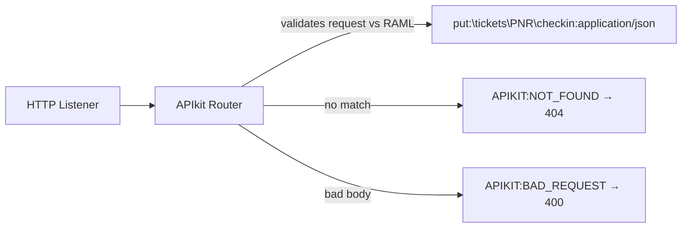
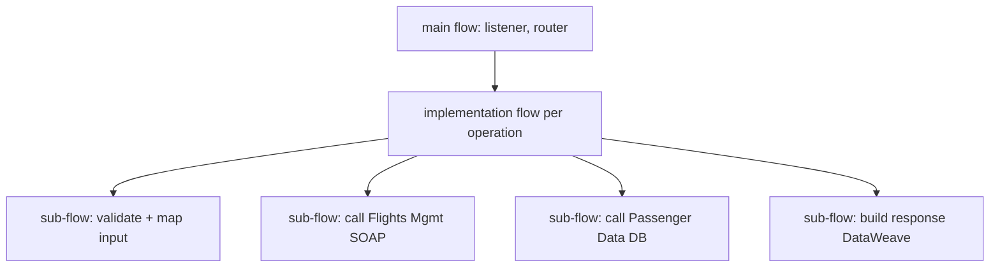

# 10 · APIkit & Flow Design *(added: not in deck)*

APIkit turns the RAML into **Mule flows** and enforces the contract at runtime.

## Generated structure

| Flow | Role |
|---|---|
| `check-in-papi-main` | Listener + APIkit router + error handlers (**autodiscovery `flowRef`** points here) |
| `check-in-papi-console` | Optional API Console |
| `put:\tickets\(PNR)\checkin:application\json:check-in-papi-config` | Your business logic for that method+resource |

Flow name = `method:\resource:contentType:configName`.

## Recommended layering

Rules of thumb: keep operation flows thin; reusable logic in sub-flows; connectors' configs global; no hardcoded values.

## Local test

Run app → `http://localhost:8081/api/...`. Use Postman/curl. See [Lab 03](../labs/lab-03-implement-apikit.md).

**Next →** [11 DataWeave](11-dataweave-basics.md)
