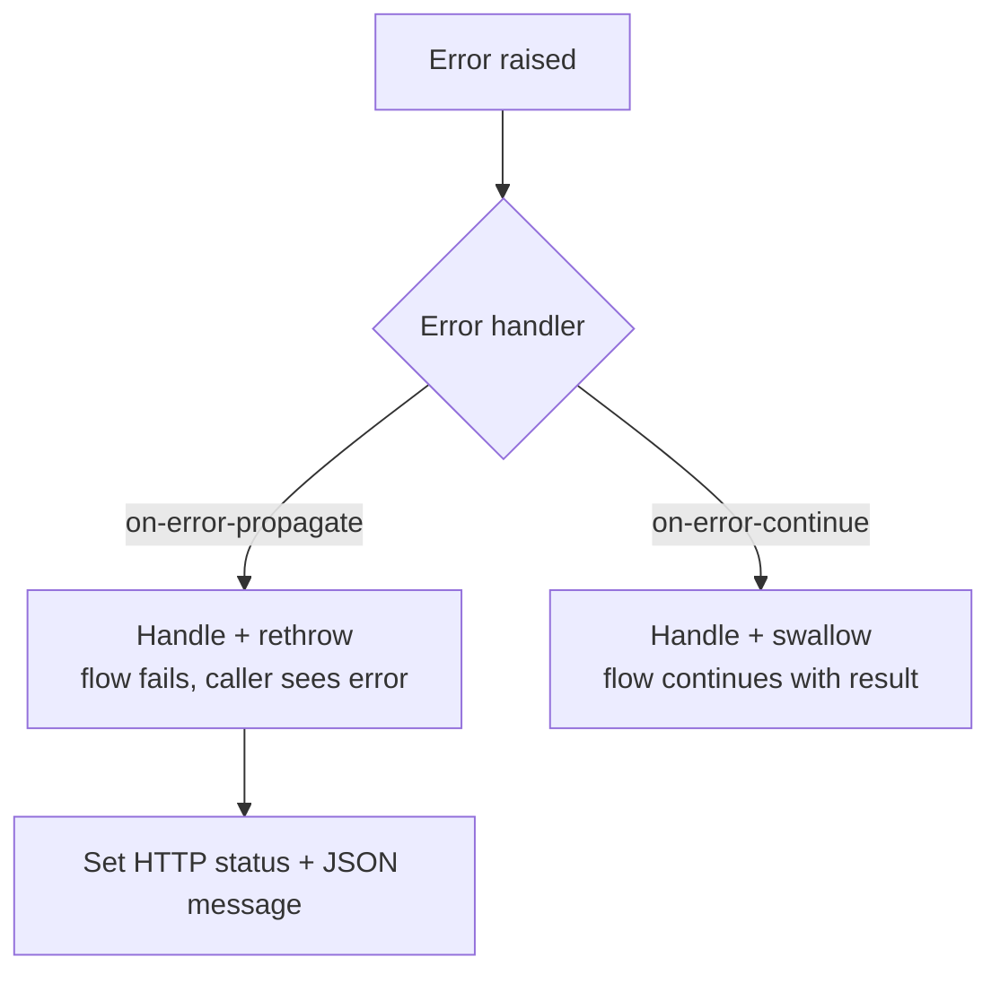

# 12 · Error Handling *(added)*



| Scope | Element | Notes |
|---|---|---|
| Flow | `error-handler` | Local to flow |
| App-wide | Global error handler + `default-error-handler` | Reuse |
| Connector | e.g. `HTTP:CONNECTIVITY`, `HTTP:TIMEOUT`, `DB:CONNECTIVITY` | Match by `type` |

## APIkit mapping in main flow

```xml
<error-handler>
  <on-error-propagate type="APIKIT:BAD_REQUEST">
    <ee:transform><ee:message><ee:set-payload><![CDATA[%dw 2.0
output application/json --- { message: "Bad request" }]]></ee:set-payload></ee:message>
      <ee:variables><ee:set-variable variableName="httpStatus">400</ee:set-variable></ee:variables></ee:transform>
  </on-error-propagate>
  <on-error-propagate type="APIKIT:NOT_FOUND"> ... 404 ... </on-error-propagate>
  <on-error-propagate type="ANY"> ... 500 ... </on-error-propagate>
</error-handler>
```

And in the listener response: `statusCode="#[vars.httpStatus default 200]"`.

## Status-code plan for Check-In PAPI

| Situation | Status |
|---|---|
| Body invalid | 400 |
| PNR not found | 404 |
| Method not allowed | 405 |
| Media type wrong | 415 |
| Flights Mgmt down | 503 |
| Anything else | 500 |

**Never leak stack traces** to consumers; log them instead.

**← Back** [11](11-dataweave-basics.md) · **Next →** [13 Properties](13-properties-secrets.md)
