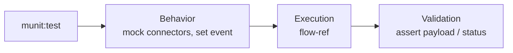

# 14 · MUnit Testing *(added; the deck's scope promised it)*

MUnit tests your Mule flows without deploying.



| Section | Purpose |
|---|---|
| Behavior | `munit-tools:mock-when` for HTTP/DB/SOAP calls, `set-event` for input |
| Execution | run the flow under test |
| Validation | `assert-that`, `assert-equals`, `verify-call` |

## Example

```xml
<munit:test name="checkin-happy-path" doc:name="checkin happy path">
  <munit:behavior>
    <munit-tools:mock-when processor="soap:consume">
      <munit-tools:then-return>
        <munit-tools:payload value="#[readUrl('classpath://mocks/flights-ok.xml')]"/>
      </munit-tools:then-return>
    </munit-tools:mock-when>
    <munit:set-event>
      <munit:attributes value="#[{uriParams:{PNR:'ABC123'}}]"/>
    </munit:set-event>
  </munit:behavior>
  <munit:execution><flow-ref name="checkin-impl-flow"/></munit:execution>
  <munit:validation>
    <munit-tools:assert-that expression="#[payload.status]" is="#[MunitTools::equalTo('CHECKED_IN')]"/>
  </munit:validation>
</munit:test>
```

## Test plan for Check-In PAPI

1. Happy path → 200 and `CHECKED_IN`
2. Unknown PNR → 404
3. Flights Mgmt timeout → 503
4. Bad body → 400 (via APIkit)
5. DataWeave unit tests for mappers

## Coverage

Studio → **Run MUnit with coverage**; set minimum (e.g. 80%) in `mule-maven-plugin`/munit plugin config so CI fails below it.

**Do it →** [Lab 06](../labs/lab-06-munit.md)
