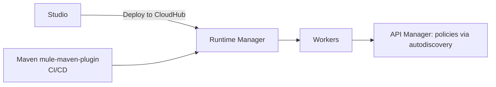

# 15 · Deploy & Operate *(added)*

## Deploy paths



## Runtime Manager settings to know

| Setting | Notes |
|---|---|
| Application name | becomes `name.region.cloudhub.io` (globally unique on SLB) |
| Runtime version | match Studio |
| Worker size / count | horizontal scaling |
| Properties tab | `mule.env=dev`, `mule.key=...` (secure), `anypoint.platform.*` |
| Deploy in VPC | needed for DLB / private on-prem |
| Logging | Logs tab, or forward to your SIEM |

## Post-deploy checklist

1. App status **Started**
2. Logs: autodiscovery success, no TLS errors
3. Call through LB: `curl -v https://<app>.cloudhub.io/api/tickets/ABC123/checkin -X PUT`
4. API Manager: instance **Active**, policies applied
5. Analytics: request visible

## Operate

- **Analytics** for traffic/latency/errors
- **Alerts** on error rate, response time
- Rotate certs and secrets before expiry (self-signed dev keystore lifetime is `-validity 365`)

## CI/CD sketch

```
mvn clean verify                # includes MUnit
mvn deploy -DmuleDeploy -Denv=dev
```

**Do it →** [Lab 07](../labs/lab-07-deploy-cloudhub.md) · [Lab 09](../labs/lab-09-mutual-tls.md)
