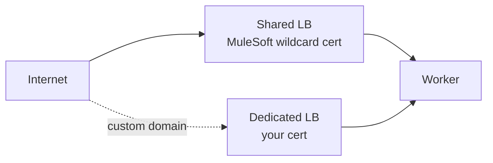
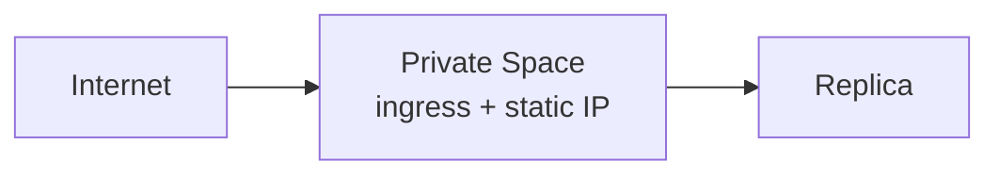
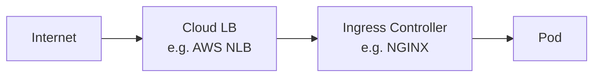

# 16 · CloudHub 1.0 vs 2.0 vs RTF: Deployment & Networking *(added)*

**Goal:** know what changes about TLS termination, networking, and "where is my VPC" at each deployment target.

## The three targets

| | CloudHub 1.0 | CloudHub 2.0 | RTF (Runtime Fabric) |
|---|---|---|---|
| What it is | MuleSoft-hosted multi-tenant PaaS | MuleSoft-hosted, container/Kubernetes-based | Your own Kubernetes cluster (your cloud/on-prem), orchestrated by Anypoint |
| Who manages the infra | MuleSoft | MuleSoft | You |
| Deploy unit | Worker | Replica | Pod |
| Network isolation | Shared by default; **Anypoint VPC** is a paid add-on | **Private Space** built in | Your own VPC, entirely |
| TLS termination | Shared LB (MuleSoft cert) or DLB (your cert) | Private Space load-balancing layer | Your choice: cloud LB, Ingress Controller, or the app itself |

## CloudHub 1.0



- Default: public traffic hits `*.cloudhub.io` via the **shared LB**, terminated with MuleSoft's own certificate — you don't manage this hop.
- **Custom domain** (e.g. `api.anyairline.com`): get a **CA-signed cert**, upload it to Runtime Manager → Certificates or to a **Dedicated Load Balancer (DLB)**, then add a `CNAME` pointing your domain at the `*.cloudhub.io` hostname.
- **VPC** is an optional paid add-on — without it, outbound traffic uses a shared, rotating IP range (a common blocker when a partner wants to IP-allowlist you). See [08 VPC & On-Prem](08-vpc-onprem-targets.md).

## CloudHub 2.0



- **Private Space** replaces the CH1 VPC add-on — every space gets network isolation, **Firewall Rules**, and optionally a VPN/Transit Gateway back to your network, built in (not a separate paid product).
- **Static IPs** (inbound/outbound) are a Private Space feature — solves CH1's rotating-IP allowlisting problem.
- Upload your CA-signed cert at the Private Space networking layer for custom-domain TLS termination.

## RTF (Runtime Fabric)



This is the only target where **you** provision the VPC, the Kubernetes nodes, and the Ingress Controller — Anypoint's control plane only deploys your app onto it.

**TLS termination — your choice:**
- At the **cloud LB** (e.g. AWS NLB + ACM cert) — internal traffic to the Ingress Controller can stay plain HTTP inside your VPC.
- At the **Ingress Controller** — cert/key stored as a Kubernetes `Secret`, referenced by the Ingress resource.
- At the **app itself** — same `tls:context` config as [09 TLS](09-tls-certificates.md), for end-to-end encryption.

```yaml
apiVersion: networking.k8s.io/v1
kind: Ingress
metadata:
  name: check-in-api-ingress
  annotations:
    kubernetes.io/ingress.class: "nginx"
spec:
  tls:
  - hosts:
    - checkin.anyairline.com
    secretName: checkin-tls-secret
  rules:
  - host: checkin.anyairline.com
    http:
      paths:
      - path: /api
        pathType: Prefix
        backend:
          service:
            name: check-in-api-svc
            port:
              number: 8082
```

`checkin-tls-secret` plays the same role as your local `.p12` keystore — just stored as a Kubernetes Secret instead of a file.

## Networking glossary

| Term | Meaning |
|---|---|
| VPC | Isolated network segment; add-on in CH1, built into CH2's Private Space, literally your own in RTF |
| Load Balancer | Distributes/routes incoming traffic; often also terminates TLS |
| Ingress Controller | Kubernetes' internal traffic router to Pods, by host/path — the RTF equivalent of "the LB" |
| Worker / Replica / Pod | The running app instance, at each platform's layer (CH1 / CH2 / RTF) |
| Private Space | CH2's built-in network isolation boundary |
| Static IP | Fixed inbound/outbound IP — needed for reliable partner IP-allowlisting |

**Do it →** [Lab 10](../labs/lab-10-cloudhub1-custom-domain.md) · [Lab 11](../labs/lab-11-cloudhub2-private-space.md) · [Lab 12](../labs/lab-12-rtf-ingress-tls.md)
**← Back** [08 VPC & On-Prem](08-vpc-onprem-targets.md) · [09 TLS](09-tls-certificates.md) · [15 Deploy & Operate](15-deploy-operate.md)
