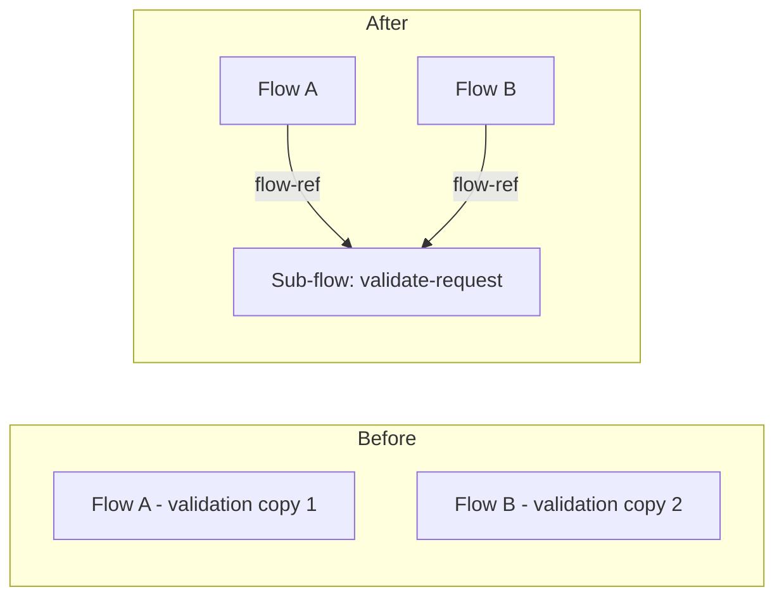
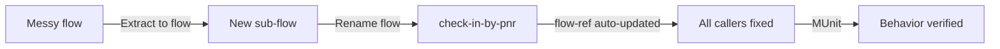

# 17 · Coding Conventions, DRY & Naming _(added)_

## DRY — Don't Repeat Yourself

Every duplicated piece of logic is a second place to fix when something changes.

| Technique                 | Applies to                                                                      |
| ------------------------- | ------------------------------------------------------------------------------- |
| **Global configurations** | Declare one connector/listener config (HTTP, DB), reference it from many flows  |
| **Sub-flows**             | Extract shared logic (validation, error-response builder), call via`<flow-ref>` |
| **Maven libraries**       | Extract logic shared*across projects* into a reusable dependency                |



Rule of thumb: about to copy-paste more than a couple of processors between flows → extract a sub-flow instead.

## Naming conventions

| Element               | Convention          | Example                                          |
| --------------------- | ------------------- | ------------------------------------------------ |
| Project / Artifact ID | kebab-case          | `check-in-papi`                                  |
| Config XML files      | fixed lowercase set | `api.xml`, `main.xml`, `global.xml`, `error.xml` |
| Flow / sub-flow       | kebab-case          | `check-in-by-pnr`                                |
| Global element        | camelCase           | `apiHttpListenerConfig`                          |

- **Never rename APIkit-generated flows** — APIkit maps them directly to RAML/OAS operations; renaming breaks the binding.
- File roles: `api.xml` = APIkit router + endpoints, `main.xml` = business logic, `global.xml` = global configs, `error.xml` = global error handlers.

## Formatting & lint

- **Eclipse formatter** — standardizes indentation/spacing/braces so diffs stay clean.
- **Line length** — kept within the team standard; wrap long comments the same way.
- **SonarLint** — IDE-level, flags issues as you type.
- **SonarQube** — server-level static analysis, run in CI to gate merges.

## Structured logging _(added)_

Plain `logger` components produce free-text lines that are hard to query once they reach Splunk/Datadog. The fix is a consistent **JSON shape per log line**, not a specific product:

```xml
<logger level="INFO" category="com.anyairline.check-in-papi"
  message="#[%dw 2.0 output application/json --- { correlationId: correlationId, flow: vars.flowName default 'unknown', message: 'PNR lookup started', pnr: attributes.uriParams.PNR }]"/>
```

Sample: [`samples/dataweave/structured-log-entry.dwl`](../samples/dataweave/structured-log-entry.dwl) — the same transform as a standalone `.dwl`, written once and copied into whichever flow/API needs it, instead of retyped inline each time.

Minimum fields worth standardizing across every API in the org: `correlationId` (Mule sets this per-message; log it, don't regenerate it), a `flow`/`transactionName`, a `message`, and whatever business key is relevant (PNR, order ID). Keep the _shape_ identical across APIs — that's what makes log aggregation searchable — while the business fields differ per API.

> Don't log full request/response payloads at `INFO` by default — that's how secure values (from [13](13-properties-secrets.md)) or PII end up in a log aggregator with a different retention/access policy than the API itself.

## check-in-papi folder structure

```
check-in-papi/
└── src/main/mule/
    ├── api.xml       # APIkit router + endpoints
    ├── error.xml     # global error handlers
    ├── global.xml    # global configs (e.g. apiHttpListenerConfig)
    ├── health.xml    # health-check endpoint flow
    └── main.xml      # business logic (e.g. check-in-by-pnr)
```

## Studio refactoring tools

| Tool                   | Does                                                            |
| ---------------------- | --------------------------------------------------------------- |
| **Extract to flow**    | Selects processors, pulls them into a new named sub-flow        |
| **Rename flow**        | Renames a flow**and** updates every `<flow-ref>` pointing to it |
| **Metadata assistant** | Attaches input/output metadata to a flow or operation           |
| **MUnit**              | Run alongside every refactor to prove behavior didn't change    |



**Used by** [14 MUnit testing](14-munit-testing.md) · **Do it →** [Lab 13](../labs/lab-13-coding-conventions.md)
