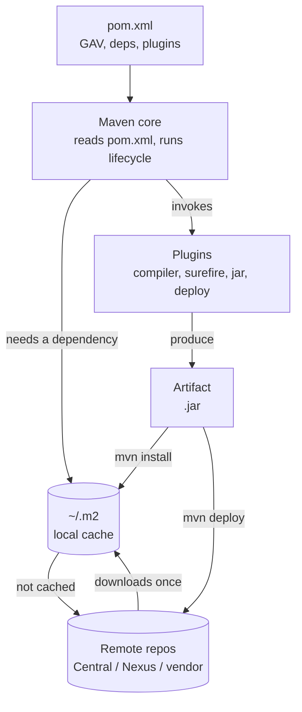
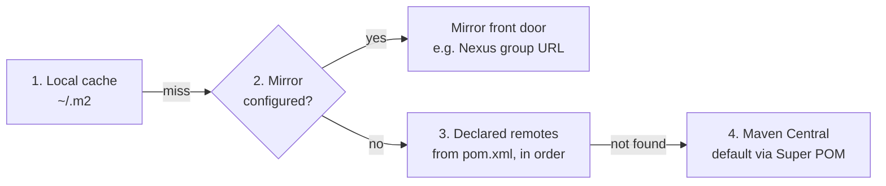
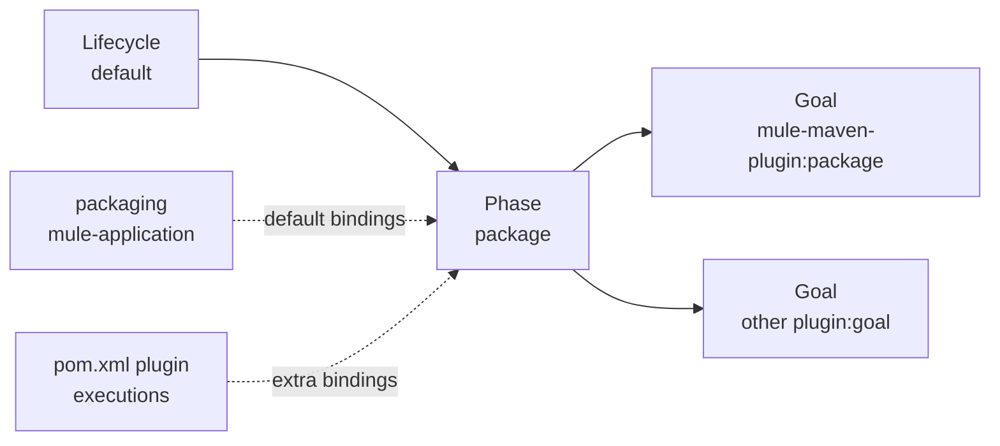
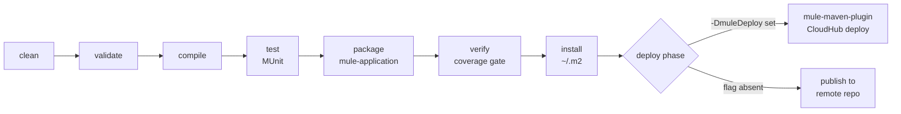

# 18 · Maven Build Fundamentals _(added)_

## What Maven is

- **Artifact-based** — one project produces one output artifact (for Mule, a deployable `.jar`).
- **A build tool** — standard lifecycle phases so any Maven project builds the same predictable way.
- **A dependency manager** — `pom.xml` declares dependency + version; Maven resolves from a repo instead of a hand-copied `lib/` folder (no more version drift between machines).
- **Extensible** — the **`mule-maven-plugin`** adds Mule-specific packaging and deploy goals.



`pom.xml` is the declaration, Maven core is the engine that reads it and drives a lifecycle, plugins do the actual work at each phase, and `~/.m2` is checked before any remote repo call.

## The six pieces

### pom.xml — the project's identity

Root `<project>` element, identified by **GAV coordinates**:

```xml
<groupId>com.cwvj</groupId>              <!-- who owns it -->
<artifactId>payments-service</artifactId> <!-- what it is -->
<version>1.0.0</version>                  <!-- which one -->
```

GAV is also how `~/.m2` lays out its folders: `~/.m2/repository/com/cwvj/payments-service/1.0.0/payments-service-1.0.0.jar`.

A minimal `pom.xml`:

```xml
<project xmlns="http://maven.apache.org/POM/4.0.0" ...>
  <modelVersion>4.0.0</modelVersion>

  <groupId>com.ai.tutorial</groupId>
  <artifactId>maven-demo-app</artifactId>
  <version>1.0-SNAPSHOT</version>
  <packaging>jar</packaging>

  <properties>
    <maven.compiler.source>17</maven.compiler.source>
    <maven.compiler.target>17</maven.compiler.target>
    <project.build.sourceEncoding>UTF-8</project.build.sourceEncoding>
  </properties>

  <dependencies>
    <dependency>
      <groupId>org.junit.jupiter</groupId>
      <artifactId>junit-jupiter-api</artifactId>
      <version>5.10.0</version>
      <scope>test</scope>
    </dependency>
  </dependencies>

  <build>
    <plugins>
      <plugin>
        <groupId>org.apache.maven.plugins</groupId>
        <artifactId>maven-compiler-plugin</artifactId>
        <version>3.11.0</version>
      </plugin>
    </plugins>
  </build>
</project>
```

`<properties>` are build-time variables (referenced as `${maven.compiler.target}`) — change a version once instead of in ten places. Every `pom.xml` implicitly inherits from Maven's built-in **Super POM** (default folder layout `src/main/java`, Maven Central as a default remote repo, default plugin bindings) — `mvn help:effective-pom` shows the fully merged result. **Credentials never go here** — they belong in `~/.m2/settings.xml`, since `pom.xml` is checked into version control.Credentials for **private** repositories — the MuleSoft EE repo, a company Nexus, Exchange — go in `settings.xml` under a `<server>` whose `<id>` matches the `<repository>` id exactly; a mismatch surfaces only as a bare 401. Template: [`samples/maven/settings-reference.xml`](../samples/maven/settings-reference.xml).

#### Three kinds of `${...}` — don't mix them up

| Syntax             | Comes from                                                                         | Example in this course                             |
| ------------------ | ---------------------------------------------------------------------------------- | -------------------------------------------------- | --- | --- |
| `${some.property}` | `<properties>` in the pom, a profile, or `-Dsome.property=...` on the command line | `${mule.maven.plugin.version}`, `${env}`           |     |     |
| `${env.NAME}`      | An **operating-system environment variable** called `NAME`                         | `${env.ANYPOINT_PASSWORD}`, `${env.MULE_KEY}`      |     |     |
| `${project.xxx}`   | The POM itself (Maven's built-in model)                                            | `${project.version}`, `${project.build.directory}` |     |     |

`${env}` (no dot) is a **Maven property** set by `-Denv=dev` or a profile; `${env.ANYPOINT_PASSWORD}` (with a dot) reads the **shell** variable. They look alike and are unrelated. A `-D` on the command line **overrides** the same property declared in the pom or a profile, which is exactly why `-Denv=qa` works on top of a default of `dev`.

### pom.xml for a Mule application — check-in-papi's actual pieces

A Mule app's `pom.xml` differs from a plain Java one in three ways: `packaging` is `mule-application` (not `jar`), dependencies are mostly **connectors** (each with `<classifier>mule-plugin</classifier>`), and connectors/`mule-maven-plugin` come from **MuleSoft's own repository**, not Central. Full annotated reference: [`samples/maven/pom-reference.xml`](../samples/maven/pom-reference.xml).

| Piece      | Artifact                                          | Used for, in this course                                                                                                                                    |
| ---------- | ------------------------------------------------- | ----------------------------------------------------------------------------------------------------------------------------------------------------------- |
| Packaging  | `mule-application`                                | Tells`mule-maven-plugin` to bundle `src/main/mule` + `src/main/resources` into a deployable app, not a plain jar                                            |
| Connector  | `mule-http-connector`                             | The public HTTP Listener (`samples/mule/https-listener.xml`) and any plain-HTTP outbound calls                                                              |
| Connector  | `mule-apikit-module`                              | Scaffolds flows from`samples/raml/check-in-papi.raml`, validates requests before your flow runs                                                             |
| Connector  | `mule-wsc-connector`                              | Calls**Flights Management** (on-prem SOAP, mutual TLS — pairs with `samples/mule/mutual-tls.xml`). Confirm the exact artifactId in the pom Studio generates |
| Connector  | `mule-db-connector` + `org.postgresql:postgresql` | Talks to**Passenger Data** (on-prem PostgreSQL); the connector needs the plain JDBC driver alongside it                                                     |
| Extension  | `mule-secure-configuration-property-extension`    | Decrypts`secure-${mule.env}.yaml` at runtime — see [13 Properties &amp; Secrets](13-properties-secrets.md)                                                  |
| Connector  | `mule-objectstore-connector`                      | Optional — only if flows use Object Store (idempotency, cached tokens)                                                                                      |
| Test       | `munit-runner`, `munit-tools`                     | `scope=test` — never shipped in the deployed artifact; power `samples/munit/checkin-test.xml`                                                               |
| Plugin     | `mule-maven-plugin`                               | Packages the`mule-application` artifact; `deploy` goal pushes to CloudHub (see below)                                                                       |
| Plugin     | `munit-maven-plugin`                              | Binds MUnit to`mvn test`/`verify`, can fail the build below a coverage threshold                                                                            |
| Repository | `repository.mulesoft.org`                         | Connectors and`mule-maven-plugin` aren't on Central — resolution fails without this declared in **both** `<repositories>` and `<pluginRepositories>`        |

### Maven core — the engine

Doesn't compile or test anything itself; it walks an ordered sequence of **phases** and triggers whatever plugin **goal** is bound to each one. Three built-in lifecycles:

| Lifecycle | Purpose                                         |
| --------- | ----------------------------------------------- |
| `default` | Build and publish software — the one used daily |
| `clean`   | Remove`target/` outputs from previous builds    |
| `site`    | Generate project documentation                  |

The next two sections (_Phases and goals_, _Lifecycle reference_) explain how phases, goals and packaging fit together. That is the part that makes `mvn deploy -DmuleDeploy` make sense.

### Remote repositories

| Type            | Example                     | Role                                                     |
| --------------- | --------------------------- | -------------------------------------------------------- |
| Public          | Maven Central               | Wired in by default via the Super POM                    |
| Company-managed | Nexus, Artifactory          | Proxies public repos + hosts internal releases/snapshots |
| Vendor          | A commercial SDK's own repo | Added explicitly, or proxied behind a company mirror     |

`<repositories>`/`<pluginRepositories>` in `pom.xml` declare where to _download_ from; `<distributionManagement>` declares where to _upload_ to (`mvn deploy`). **Dependencies and plugins are resolved from two separate lists** — a MuleSoft repo declared only under `<repositories>` still fails with "plugin not found". Resolution order:



Gotcha: a match-all mirror (`mirrorOf="*"`) does **not** auto-fall-back to Central — the mirror itself must proxy Central and any vendor repos you need, or resolution fails.

### Dependencies

| Section                  | Adds to classpath?         | Purpose                                                                      |
| ------------------------ | -------------------------- | ---------------------------------------------------------------------------- |
| `<dependencyManagement>` | No — version rulebook only | Declares which version to use (often via an imported BOM), if later declared |
| `<dependencies>`         | Yes                        | Actually puts the library + transitives on the classpath                     |

Scope table:

| Scope               | Compile CP | Test CP | Runtime CP | Typical use                                        |
| ------------------- | ---------- | ------- | ---------- | -------------------------------------------------- |
| `compile` (default) | Yes        | Yes     | Yes        | Needed to compile and run                          |
| `test`              | No         | Yes     | No         | Only tests need it (JUnit, MUnit)                  |
| `provided`          | Yes        | Yes     | No         | Container/runtime supplies it                      |
| `runtime`           | No         | Yes     | Yes        | Needed only to run (e.g. JDBC driver)              |
| `import`            | —          | —       | —          | Only inside`dependencyManagement`, to import a BOM |

`import` is the mechanism behind a **BOM** — a `pom`-packaged artifact carrying only `<dependencyManagement>`, so consuming projects declare connectors with no `<version>` at all. See [19 Parameterization, Parent POM &amp; BOM](19-parent-pom-bom-parameterization.md).

Security rule of thumb: narrowest scope that works — smaller attack surface, smaller artifact.

**Mule-specific:** `<classifier>mule-plugin</classifier>` makes the runtime load a connector as an **isolated plugin** (its own classloader). The JDBC driver has no classifier because it is a plain jar, not a Mule plugin.

Inspect what you actually pulled in: `mvn dependency:tree` (full graph, shows which connector dragged in which library) and `mvn dependency:tree -Dincludes=org.postgresql` (filter to one library).

### Plugins — the actual workers

Default bindings for `jar` packaging:

| Phase          | Plugin:goal            | Does                   |
| -------------- | ---------------------- | ---------------------- |
| `compile`      | `compiler:compile`     | Compiles main sources  |
| `test-compile` | `compiler:testCompile` | Compiles test sources  |
| `test`         | `surefire:test`        | Runs unit tests        |
| `package`      | `jar:jar`              | Builds the JAR         |
| `install`      | `install:install`      | Copies to`~/.m2`       |
| `deploy`       | `deploy:deploy`        | Uploads to remote repo |

`pluginManagement` pins **versions** only — without pinning, different machines/CI agents can resolve different default plugin versions, causing inconsistent builds. Pin in `pluginManagement`; add custom bindings under `<build><plugins><executions>`.
Once a second API exists, that pinning belongs in a **parent POM** rather than being copy-pasted — [19](19-parent-pom-bom-parameterization.md) does that extraction.

Two rules that bite people:

1. **Declare a plugin once.** Putting `mule-maven-plugin` in `<plugins>` twice (for example, the bare block from the reference plus the deploy snippet) gives a warning on Maven 3 and **fails the build on Maven 4**. Merge the blocks into one.
2. **`<extensions>true</extensions>`** is what lets `mule-maven-plugin` register the `mule-application` packaging type. Without it, Maven stops at project load with an unknown-packaging error.

### ~/.m2 — the local cache

Default `~/.m2/repository`, laid out by GAV. Also holds `settings.xml` — a separate file (not the cache itself) with **mirrors**, **server credentials**, **proxies**; never committed to source control. Cache hit = zero network calls, which is what makes `mvn -o` (offline mode) possible. Template: [`samples/maven/settings-example.xml`](../samples/maven/settings-example.xml).

## Phases and goals: how Maven decides what runs

A **lifecycle** is an ordered list of **phases**. A phase does nothing by itself; it runs whatever plugin **goals** are bound to it.



- **Asking for a phase runs every earlier phase in that lifecycle.** `mvn package` runs `validate → … → package`; you never list the earlier ones.
- **A phase with no goals bound does not run at all.** Empty phases cost nothing.
- **Goals come from two places:** the `<packaging>` value (its built-in bindings) and the plugins you add. Packaging goals run first; then those from the pom, in the order declared.
- **A goal can also be called directly**, outside the lifecycle: `mvn dependency:tree`. You can mix phases and goals: `mvn clean dependency:copy-dependencies package` runs `clean`, then that goal, then `package` with all its earlier phases.
- **Adding a plugin is not enough.** You must also name the goals to run (`<executions><execution><goals>…`), unless the plugin binds its goal by default.

Applied to this project, in `pom-reference.xml`:

- `packaging = mule-application` provides Mule's own build goals.
- `munit-maven-plugin` adds `test` and `coverage-report`, bound to the `test` phase, so MUnit runs in `mvn test`/`verify`.
- `mule-maven-plugin` provides the `deploy` goal, which acts only when `-DmuleDeploy` is present.

**See it for yourself.** Every goal prints as `--- plugin:version:goal (execution-id) @ project ---` in the console. Run `mvn clean verify` and read down the list: that _is_ your project's phase-to-goal map. Confirm bindings for your exact plugin version this way (or with `mvn help:describe -Dcmd=deploy`), since they can differ between `mule-maven-plugin` releases.

## Lifecycle reference

### Default lifecycle (all phases, in order)

| Phase                                                                 | What it does                                                   | In this course                         |
| --------------------------------------------------------------------- | -------------------------------------------------------------- | -------------------------------------- |
| `validate`                                                            | Checks the project and`pom.xml` are correct                    | Catches bad XML / missing coordinates  |
| `initialize`                                                          | Sets properties, creates directories                           | —                                      |
| `generate-sources` / `process-sources`                                | Generate / filter source                                       | Mule plugin prepares the app sources   |
| `generate-resources` / `process-resources`                            | Copy and filter resources into`target/`                        | `src/main/resources` (properties YAML) |
| `compile`                                                             | Compile / validate the app                                     | Mule app structure and config check    |
| `process-classes`                                                     | Post-process compiled output                                   | —                                      |
| `generate-test-*` / `process-test-*` / `test-compile`                 | Prepare and compile tests                                      | MUnit suites under`src/test/munit`     |
| `test`                                                                | Run unit tests, no packaging needed                            | **MUnit runs here**                    |
| `prepare-package`                                                     | Last touches before packaging                                  | —                                      |
| `package`                                                             | Build the distributable                                        | The`mule-application` artifact         |
| `pre-integration-test` / `integration-test` / `post-integration-test` | Set up, run, tear down integration tests                       | Not used here                          |
| `verify`                                                              | Quality checks on the packaged result                          | **MUnit coverage gate**                |
| `install`                                                             | Copy artifact into`~/.m2`                                      | Local reuse only                       |
| `deploy`                                                              | Publish: to a remote repo, or (with`-DmuleDeploy`) to CloudHub | **Lab 14**                             |

### Clean and site lifecycles

| Lifecycle | Phases (in order)                                 |
| --------- | ------------------------------------------------- |
| `clean`   | `pre-clean` → `clean` → `post-clean`              |
| `site`    | `pre-site` → `site` → `post-site` → `site-deploy` |

`mvn clean deploy` is two lifecycles back to back: first `clean`, then `default` up to `deploy`. `clean` is **not** part of the default lifecycle, so `mvn deploy` alone reuses whatever is in `target/`.

### Which phase should I call?

| You want…               | Run                                   | Why                                                                                                |
| ----------------------- | ------------------------------------- | -------------------------------------------------------------------------------------------------- |
| A quick compile check   | `mvn compile`                         | Stops early                                                                                        |
| Unit tests only         | `mvn test`                            | MUnit, no packaging                                                                                |
| The deployable artifact | `mvn package`                         | Also runs tests                                                                                    |
| Not sure / CI build     | **`mvn clean verify`**                | Preferred default: runs everything up to`verify`, including tests, packaging and the coverage gate |
| Push to CloudHub        | `mvn clean deploy -DmuleDeploy -Pdev` | Everything above, then deploy                                                                      |

**Do not call `integration-test` directly.** Hyphenated phases (`pre-*`, `post-*`, `process-*`) prepare or tear down work and are meant to be reached through `verify`. Calling `integration-test` alone can skip the cleanup and leave test containers or processes running. This project has no separate integration-test phase, but it is the habit to keep for any Maven project.

## Profiles and properties: one pom, many environments

A **profile** is a named set of overrides. `pom-reference.xml` defines `dev`, `qa` and `prod`; each changes the environment name, worker count and worker size, and the plugin block never changes.

| How to select         | Command                            |
| --------------------- | ---------------------------------- |
| A profile             | `mvn deploy -DmuleDeploy -Pprod`   |
| Just the property     | `mvn deploy -DmuleDeploy -Denv=qa` |
| Check what is active  | `mvn help:active-profiles`         |
| See the merged result | `mvn help:effective-pom -Pprod`    |

Use `-P` when several values change together (env + workers + size). Use `-D` for a one-off override. Where the same property appears twice, precedence is: command line `-D` > active profile > pom `<properties>`.

## SNAPSHOT vs RELEASE

|             | RELEASE (`1.0.0`)                          | SNAPSHOT (`1.0.1-SNAPSHOT`)                      |
| ----------- | ------------------------------------------ | ------------------------------------------------ |
| Mutability  | Immutable once published                   | Mutable — each deploy is a new timestamped build |
| Re-fetch    | Won't re-download once cached (unless`-U`) | Re-checked per remote repo's`updatePolicy`       |
| Typical use | Stable, promoted artifact                  | Active development build                         |

## Sharing code across projects

Don't copy-paste the same utility code into every microservice: build it as a standalone Maven project, `mvn install`/`deploy` it, then add it as a normal `<dependency>` in every project that needs it — same local-cache-then-remote resolution as any other dependency. In Mule this is how shared libraries and common error-handling fragments get reused; the same idea applies to Exchange assets.

## Daily commands

```
mvn clean verify                  # the default CI build: compile, MUnit, package, coverage gate
mvn clean install                 # fresh local build, cached to ~/.m2
mvn package                       # build the artifact (still runs tests)
mvn -DskipTests package           # skip standard Maven tests; MUnit has its own flag, check your plugin version
mvn -DskipMunitTests package      # skip MUnit (MUnit plugin flag) - never in CI
mvn dependency:tree               # inspect the full dependency graph
mvn help:effective-pom            # see the fully merged POM (Super POM + parent + yours)
mvn help:active-profiles          # which profiles are on
mvn help:describe -Dcmd=deploy    # what the deploy phase runs for this project
mvn -U package                    # force re-check of SNAPSHOTs/plugin updates
mvn -o package                    # offline — use ~/.m2 only, no network
mvn -B clean verify               # batch mode: no colour or prompts, right for CI logs
```

## Deploying to CloudHub from Maven

```
mvn clean verify                          # runs MUnit, packages, checks coverage
mvn clean deploy -DmuleDeploy -Pdev       # same, then pushes to CloudHub dev
```

What happens on the second command:



The same commands are sketched in [15 Deploy &amp; Operate](15-deploy-operate.md)'s CI/CD section. `mule-maven-plugin`'s `deploy` goal targets CloudHub, with environment-specific values injected through `-Pdev` (or `-Denv=dev`). Which per-env property file loads is the same `mule.env` / `config-${mule.env}.yaml` mechanism from [13 Properties &amp; Secrets](13-properties-secrets.md) — Maven just sets the property at build/deploy time instead of Runtime Manager's UI.

### What the `cloudHubDeployment` block sets

Full field-by-field commentary: [`samples/maven/pom-cloudhub-deploy-snippet.xml`](../samples/maven/pom-cloudhub-deploy-snippet.xml).

| Setting                           | Why it matters                                                                                          |
| --------------------------------- | ------------------------------------------------------------------------------------------------------- |
| `uri`                             | Control plane URL (US vs EU). Wrong one → "org/environment not found"                                   |
| `muleVersion`                     | Runtime CloudHub provisions; keep equal to the runtime you tested on                                    |
| `environment`                     | Must match the Anypoint environment name exactly                                                        |
| `applicationName`                 | Becomes the CloudHub domain;**globally unique** on CloudHub                                             |
| `region`, `workers`, `workerType` | Where the app runs, how many workers, and what size. Two workers in PROD gives HA and rolling redeploys |
| `properties`                      | Plain properties (`mule.env`) — visible in Runtime Manager                                              |
| `securedProperties`               | Masked properties — put`mule.key` here, **not** in `properties`                                         |

### Where secrets come from

| Value                                                                    | Source                                               | Never                                |
| ------------------------------------------------------------------------ | ---------------------------------------------------- | ------------------------------------ |
| `ANYPOINT_USERNAME` / `ANYPOINT_PASSWORD` (or Connected App id + secret) | OS env vars, CI secret store, or`~/.m2/settings.xml` | In`pom.xml`                          |
| `MULE_KEY`                                                               | OS env var / CI secret                               | In plain`<properties>`, or committed |

A **Connected App** (client credentials, scoped to "Deploy Applications") is preferred for CI: it is not tied to a person, so password changes, MFA and staff turnover do not break the pipeline.

### Reaching the on-prem systems

Deploying successfully does not mean the app can reach Flights Management (SOAP, mutual TLS) or Passenger Data (PostgreSQL). Public CloudHub cannot see a private network: you need a VPC plus VPN/Direct Connect and firewall rules ([07](07-networking-cloudhub.md), [08](08-vpc-onprem-targets.md)). Maven only ships the app; it does not build the network.

### Common build and deploy failures

| Symptom                                                      | Likely cause                                                                                       |
| ------------------------------------------------------------ | -------------------------------------------------------------------------------------------------- |
| "Unknown packaging: mule-application"                        | Missing`<extensions>true</extensions>` on `mule-maven-plugin`                                      |
| Plugin or connector "not found"                              | MuleSoft repo missing from`<repositories>` **or** `<pluginRepositories>`                           |
| Warning (Maven 3) / failure (Maven 4) about duplicate plugin | `mule-maven-plugin` declared twice in `<plugins>`                                                  |
| Build fails at`verify` with coverage message                 | MUnit coverage below the required percentage                                                       |
| `${env.X}` resolves to an empty string or literal            | Shell variable not exported in that terminal / CI job                                              |
| "Application name is already in use"                         | `applicationName` is not globally unique                                                           |
| 401 Unauthorized                                             | Wrong credentials, MFA on the user, or Connected App missing Deploy scope                          |
| Deploy "succeeds" but the app is FAILED                      | Wrong`MULE_KEY` (secure YAML cannot decrypt) or a missing property — read the Runtime Manager logs |
| Deploy OK, on-prem calls time out                            | No VPC/VPN or firewall closed                                                                      |

**Do it →** [Lab 14](../labs/lab-14-maven-parameterize-deploy.md)
**Next →** [19 Parameterization, Parent POM &amp; BOM](19-parent-pom-bom-parameterization.md)
