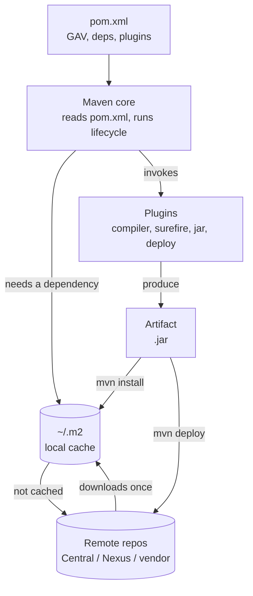
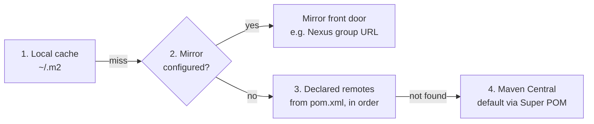

# 18 · Maven Build Fundamentals *(added)*

## What Maven is

- **Artifact-based** — one project produces one output artifact (for Mule, a deployable `.jar`).
- **A build tool** — standard lifecycle phases so any Maven project builds the same predictable way.
- **A dependency manager** — `pom.xml` declares dependency + version; Maven resolves from a repo instead of a hand-copied `lib/` folder (no more version drift between machines).
- **Extensible** — the **`mule-maven-plugin`** adds Mule-specific packaging and deploy goals.



`pom.xml` is the declaration, Maven core is the engine that reads it and drives a lifecycle, plugins do the actual work at each phase, and `~/.m2` is checked before any remote repo call.

## The six pieces

### pom.xml — the project's identity

Root `<project>` element, identified by **GAV coordinates**:

```xml
<groupId>com.cwvj</groupId>              <!-- who owns it -->
<artifactId>payments-service</artifactId> <!-- what it is -->
<version>1.0.0</version>                  <!-- which one -->
```

GAV is also how `~/.m2` lays out its folders: `~/.m2/repository/com/cwvj/payments-service/1.0.0/payments-service-1.0.0.jar`.

A minimal `pom.xml`:

```xml
<project xmlns="http://maven.apache.org/POM/4.0.0" ...>
  <modelVersion>4.0.0</modelVersion>

  <groupId>com.ai.tutorial</groupId>
  <artifactId>maven-demo-app</artifactId>
  <version>1.0-SNAPSHOT</version>
  <packaging>jar</packaging>

  <properties>
    <maven.compiler.source>17</maven.compiler.source>
    <maven.compiler.target>17</maven.compiler.target>
    <project.build.sourceEncoding>UTF-8</project.build.sourceEncoding>
  </properties>

  <dependencies>
    <dependency>
      <groupId>org.junit.jupiter</groupId>
      <artifactId>junit-jupiter-api</artifactId>
      <version>5.10.0</version>
      <scope>test</scope>
    </dependency>
  </dependencies>

  <build>
    <plugins>
      <plugin>
        <groupId>org.apache.maven.plugins</groupId>
        <artifactId>maven-compiler-plugin</artifactId>
        <version>3.11.0</version>
      </plugin>
    </plugins>
  </build>
</project>
```

`<properties>` are build-time variables (referenced as `${maven.compiler.target}`) — change a version once instead of in ten places. Every `pom.xml` implicitly inherits from Maven's built-in **Super POM** (default folder layout `src/main/java`, Maven Central as a default remote repo, default plugin bindings) — `mvn help:effective-pom` shows the fully merged result. **Credentials never go here** — they belong in `~/.m2/settings.xml`, since `pom.xml` is checked into version control.

### Maven core — the engine

Doesn't compile or test anything itself; it walks an ordered sequence of **phases** and triggers whatever plugin **goal** is bound to each one. Three built-in lifecycles:

| Lifecycle | Purpose |
|---|---|
| `default` | Build and publish software — the one used daily |
| `clean` | Remove `target/` outputs from previous builds |
| `site` | Generate project documentation |

### Remote repositories

| Type | Example | Role |
|---|---|---|
| Public | Maven Central | Wired in by default via the Super POM |
| Company-managed | Nexus, Artifactory | Proxies public repos + hosts internal releases/snapshots |
| Vendor | A commercial SDK's own repo | Added explicitly, or proxied behind a company mirror |

`<repositories>`/`<pluginRepositories>` in `pom.xml` declare where to *download* from; `<distributionManagement>` declares where to *upload* to (`mvn deploy`). Resolution order:



Gotcha: a match-all mirror (`mirrorOf="*"`) does **not** auto-fall-back to Central — the mirror itself must proxy Central and any vendor repos you need, or resolution fails.

### Dependencies

| Section | Adds to classpath? | Purpose |
|---|---|---|
| `<dependencyManagement>` | No — version rulebook only | Declares which version to use (often via an imported BOM), if later declared |
| `<dependencies>` | Yes | Actually puts the library + transitives on the classpath |

Scope table:

| Scope | Compile CP | Test CP | Runtime CP | Typical use |
|---|---|---|---|---|
| `compile` (default) | Yes | Yes | Yes | Needed to compile and run |
| `test` | No | Yes | No | Only tests need it (JUnit, MUnit) |
| `provided` | Yes | Yes | No | Container/runtime supplies it |
| `runtime` | No | Yes | Yes | Needed only to run (e.g. JDBC driver) |
| `import` | — | — | — | Only inside `dependencyManagement`, to import a BOM |

Security rule of thumb: narrowest scope that works — smaller attack surface, smaller artifact.

### Plugins — the actual workers

Default bindings for `jar` packaging:

| Phase | Plugin:goal | Does |
|---|---|---|
| `compile` | `compiler:compile` | Compiles main sources |
| `test-compile` | `compiler:testCompile` | Compiles test sources |
| `test` | `surefire:test` | Runs unit tests |
| `package` | `jar:jar` | Builds the JAR |
| `install` | `install:install` | Copies to `~/.m2` |
| `deploy` | `deploy:deploy` | Uploads to remote repo |

`pluginManagement` pins **versions** only — without pinning, different machines/CI agents can resolve different default plugin versions, causing inconsistent builds. Pin in `pluginManagement`; add custom bindings under `<build><plugins><executions>`.

### ~/.m2 — the local cache

Default `~/.m2/repository`, laid out by GAV. Also holds `settings.xml` — a separate file (not the cache itself) with **mirrors**, **server credentials**, **proxies**; never committed to source control. Cache hit = zero network calls, which is what makes `mvn -o` (offline mode) possible.

## SNAPSHOT vs RELEASE

| | RELEASE (`1.0.0`) | SNAPSHOT (`1.0.1-SNAPSHOT`) |
|---|---|---|
| Mutability | Immutable once published | Mutable — each deploy is a new timestamped build |
| Re-fetch | Won't re-download once cached (unless `-U`) | Re-checked per remote repo's `updatePolicy` |
| Typical use | Stable, promoted artifact | Active development build |

## Sharing code across projects

Don't copy-paste the same utility code into every microservice: build it as a standalone Maven project, `mvn install`/`deploy` it, then add it as a normal `<dependency>` in every project that needs it — same local-cache-then-remote resolution as any other dependency.

## Lifecycle phases

`mvn deploy` runs every phase before it automatically:

| Phase | What happens |
|---|---|
| `validate` | Checks project structure / `pom.xml` |
| `compile` | Compiles source |
| `test-compile` | Compiles test sources |
| `test` | Runs unit tests (MUnit for Mule) |
| `package` | Produces the artifact (`.jar`) |
| `verify` | Integration checks on the packaged artifact |
| `install` | Copies artifact into local `~/.m2` |
| `deploy` | Pushes to a remote repo, or via `mule-maven-plugin` straight to CloudHub |

```
validate → compile → test-compile → test → package → verify → install → deploy
```

## Daily commands

```bash
mvn clean install                 # fresh local build, cached to ~/.m2
mvn -DskipTests package           # build fast, skip tests
mvn dependency:tree               # inspect the full dependency graph
mvn help:effective-pom            # see the fully merged POM (Super POM + parent + yours)
mvn -U package                    # force re-check of SNAPSHOTs/plugin updates
mvn -o package                    # offline — use ~/.m2 only, no network
```

## Deploying to CloudHub from Maven

```bash
mvn clean verify                # runs MUnit
mvn deploy -DmuleDeploy -Denv=dev
```

Same command already sketched in [15 Deploy & Operate](15-deploy-operate.md)'s CI/CD section — that's the `mule-maven-plugin`'s `deploy` goal targeting CloudHub, with environment-specific credentials/properties injected via `-Denv=dev` and a Maven profile. Which per-env property file gets loaded is the same `mule.env`/`config-${mule.env}.yaml` mechanism from [13 Properties & Secrets](13-properties-secrets.md) — Maven just sets the property at build/deploy time instead of Runtime Manager's UI.

**Do it →** [Lab 14](../labs/lab-14-maven-parameterize-deploy.md)
