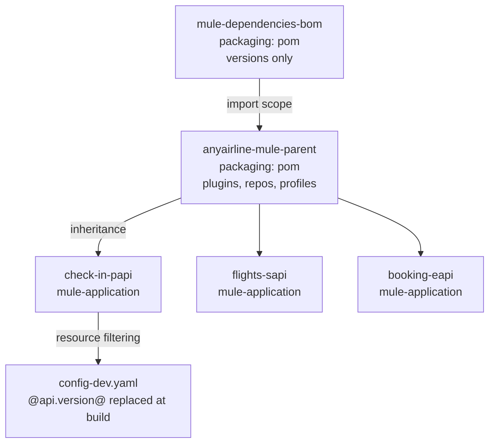

# 19 · Parameterization, Parent POM & BOM _(added)_

📖 **Read first:** [18 Maven Build Fundamentals](18-maven-build.md) · [13 Properties &amp; Secrets](13-properties-secrets.md)
🎯 **End state:** no value written twice — the API spec version, connector versions and plugin config each live in exactly one place.

[18](18-maven-build.md) covered one app's `pom.xml`. This covers what breaks once there are three apps: the same plugin block copy-pasted three times, and the same API version written in both `pom.xml` and `config-${mule.env}.yaml`.



## 1 · The POM is the unit of work

Everything Maven knows about the project sits in one file: coordinates, packaging (`jar` / `pom` / `mule-application`), dependencies and the repositories they come from, build configuration and plugin management. Three packagings matter here:

| Packaging            | Produces               | Used by                    |
| -------------------- | ---------------------- | -------------------------- |
| `mule-application` | deployable app         | `check-in-papi`          |
| `pom`              | nothing — config only | the parent POM and the BOM |
| `jar`              | plain library          | shared Java utils          |

Every `pom.xml` implicitly inherits the **Super POM** (see [18](18-maven-build.md)). `mvn help:effective-pom` is how you answer "where did this value actually come from?" once a parent and a BOM are both in play.

Anything per-machine or secret is externalised to `~/.m2/settings.xml`, never the POM: mirrors, proxies, and **credentials for private repositories** — including the MuleSoft **EE** repo (`repository.mulesoft.org/nexus-ee/...`), which returns 401 without a `<server>` entry whose `<id>` matches the `<repository>` id. Template: [`samples/maven/settings-reference.xml`](../samples/maven/settings-reference.xml).

## 2 · Identifying configuration redundancy

Externalising Mule config into `config-${mule.env}.yaml` ([13](13-properties-secrets.md)) is the first step. It does **not** remove the second kind of duplication — values that a *dependency* and the *runtime* both need.

`pom.xml` needs the spec coordinates to pull the RAML from Exchange:

```xml
<dependency>
  <groupId>6ebe1206-ddb1-4f2a-b06e-dca3244ebbad</groupId>
  <artifactId>check-in-papi</artifactId>
  <version>1.0.3</version>
  <classifier>raml</classifier>
  <type>zip</type>
</dependency>
````

`config-dev.yaml` needs the same three values at runtime:

```yaml
api:
  groupId: "6ebe1206-ddb1-4f2a-b06e-dca3244ebbad"
  artifactId: "check-in-papi"
  version: "1.0.3"
```

Bump the spec to `1.0.4`, change one file and not the other, and the app builds against the new contract while reporting the old one. Nothing fails at build time — it surfaces in Runtime Manager.

## 3 · Removing it with Maven resource filtering

Single source of truth = POM properties. Filtering substitutes them while resources are copied into `target/classes`.

```xml
<properties>
  <api.groupId>6ebe1206-ddb1-4f2a-b06e-dca3244ebbad</api.groupId>
  <api.artifactId>check-in-papi</api.artifactId>
  <api.version>1.0.3</api.version>
</properties>

<build>
  <resources>
    <resource>
      <directory>src/main/resources</directory>
      <filtering>true</filtering>
    </resource>
  </resources>
</build>
```

### ⚠ The `${...}` collision

Mule's property placeholders use `${...}` too. With Maven's default delimiters, filtering tries to resolve **every** `${...}` in the YAML at build time — so `${secure::db.password}` is either blanked or fails the build. Give Maven its own delimiter:

```xml
<plugin>
  <groupId>org.apache.maven.plugins</groupId>
  <artifactId>maven-resources-plugin</artifactId>
  <version>${maven.resources.plugin.version}</version>
  <configuration>
    <useDefaultDelimiters>false</useDefaultDelimiters>
    <delimiters><delimiter>@</delimiter></delimiters>
  </configuration>
</plugin>
```

Then `@...@` = Maven, build time. `${...}` = Mule runtime. Example: [`samples/maven/config-filtered.yaml`](../samples/maven/config-filtered.yaml).

> **Studio gotcha:** Studio's embedded runtime launches from `src/main/*`, which is _not_ filtered — it will see the literal `@api.version@`. Run `mvn process-resources` before launching, or keep a Studio-only `config-local.yaml`.

Verify:

```bash
mvn process-resources
cat target/classes/config-dev.yaml   # no @...@ left; ${secure::...} untouched
```

## 4 · Parent POM — build redundancy and reproducibility

`samples/maven/pom-reference.xml` is ~470 lines. Copy it into a second and third API and every fix has to be made three times; worse, the three drift and stop being reproducible. A parent POM (`packaging: pom`) holds what is identical:

| Move to parent                                                                               | Keep in the app                                            |
| -------------------------------------------------------------------------------------------- | ---------------------------------------------------------- |
| `<pluginManagement>` for `mule-maven-plugin`, `munit-maven-plugin`, `maven-resources-plugin` | the`<plugins>` entries that activate them (no `<version>`) |
| `<repositories>` / `<pluginRepositories>`                                                    | —                                                          |
| `<distributionManagement>`                                                                   | —                                                          |
| `dev` / `qa` / `prod` profiles, `ch.workers`, `ch.worker.type`, `ch.region`                  | `applicationName`, this app's `api.*` properties           |
| `app.runtime`, encoding, coverage threshold                                                  | the connector`<dependencies>` it actually uses             |

Reproducibility comes from pinning: with plugin versions declared once in `pluginManagement`, a developer laptop and a CI agent resolve the same plugin, not whatever default each picked.

```xml
<parent>
  <groupId>com.anyairline</groupId>
  <artifactId>anyairline-mule-parent</artifactId>
  <version>1.0.0</version>
</parent>
```

Sample: [`samples/maven/parent-pom.xml`](../samples/maven/parent-pom.xml) · slimmed child: [`samples/maven/pom-child-with-parent.xml`](../samples/maven/pom-child-with-parent.xml).

> Inheritance (`<parent>`) and aggregation (`<modules>`) are independent. Here we want inheritance only — each API keeps its own release cycle.

## 5 · BOM — centralising versions

A **Bill of Materials** is a `pom`-packaged artifact containing only `<dependencyManagement>` (and often `<pluginManagement>`). Consumers import it and then omit `<version>` entirely:

```xml
<dependencyManagement>
  <dependencies>
    <dependency>
      <groupId>com.anyairline</groupId>
      <artifactId>anyairline-mule-bom</artifactId>
      <version>1.0.0</version>
      <type>pom</type>
      <scope>import</scope>
    </dependency>
  </dependencies>
</dependencyManagement>
```

```xml
<dependency>
  <groupId>org.mule.connectors</groupId>
  <artifactId>mule-http-connector</artifactId>
  <classifier>mule-plugin</classifier>
  <!-- version comes from the BOM -->
</dependency>
```

`import` scope is the one from the scope table in [18](18-maven-build.md) — it is valid **only** inside `<dependencyManagement>`, and it is not inheritance: the managed versions are merged in, so a single app can still pin a different version locally when it has to.

|                   | Parent POM                             | BOM               |
| ----------------- | -------------------------------------- | ----------------- |
| Mechanism         | `<parent>` inheritance                 | `import` scope    |
| Carries           | plugins, profiles, repos, distribution | versions only     |
| How many          | one (Maven is single-inheritance)      | many              |
| Breaks when wrong | how apps build                         | what apps resolve |

Upgrading `mule-http-connector` across all three APIs becomes: bump one version in the BOM, release it, bump the BOM version in the parent.

Sample: [`samples/maven/bom-pom.xml`](../samples/maven/bom-pom.xml).

## 6 · Order of work

1. Extract Mule config values → `config-${mule.env}.yaml` + `secure-${mule.env}.yaml` ([13](13-properties-secrets.md)).
2. Remove config redundancy → POM properties + resource filtering with `@...@`.
3. Remove build redundancy → parent POM.
4. Centralise versions → BOM, imported by the parent.

Do them in that order: steps 3 and 4 are much easier once nothing app-specific is left hardcoded.

## Checklist

- [ ] No credentials in any `pom.xml`
- [ ] The API spec version appears exactly once in the repo
- [ ] App POMs contain no plugin `<version>` elements
- [ ] `mvn process-resources` leaves no `@...@` in `target/classes/`
- [ ] `mvn help:effective-pom` shows the expected merged result
- [ ] `mvn clean verify -Pdev` passes from a cold `~/.m2`

## Common failures

| Symptom                                               | Cause                                                                 |
| ----------------------------------------------------- | --------------------------------------------------------------------- |
| `${secure::db.password}` is empty in `target/classes` | Filtering ran with default `${}` delimiters                           |
| Studio shows the literal `@api.version@`              | Studio runs unfiltered `src/main/`; run `mvn process-resources`       |
| Child build can't find the parent                     | Parent not `mvn install`ed / not published to Exchange                |
| `version is required` on a BOM-managed dependency     | BOM imported outside `<dependencyManagement>`, or wrong `<type>pom</type>` |
| 401 from the EE repo                                  | No `<server>` in `settings.xml` with a matching `<id>`                |

**Do it →** [Lab 15](../labs/lab-15-parent-pom-bom.md)
