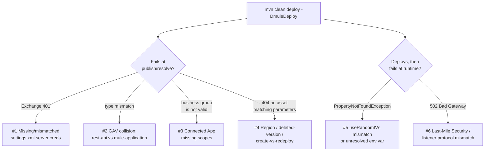

# 20 · CloudHub 2.0 Maven Deploy: Field Notes _(added)_

📖 **Read first:** [09 TLS & Certificates](09-tls-certificates.md) · [13 Properties & Secrets](13-properties-secrets.md) · [16 CloudHub 1.0 vs 2.0 vs RTF](16-cloudhub-rtf-deployment-targets.md) · [18 Maven Build Fundamentals](18-maven-build.md)
🎯 **End state:** you can read a CloudHub 2.0 Maven-deploy failure and know which of six unrelated causes actually produced it, instead of guessing at the error text.

[15](15-deploy-operate.md) and [18](18-maven-build.md) cover the happy path: `mvn deploy -DmuleDeploy` builds, publishes, deploys. This is what to check when that command fails — six confirmed causes, each written up as it actually presented, with the official MuleSoft behaviour it rests on. Every claim below was checked against current MuleSoft documentation before being written down; where something was **observed but not independently confirmed**, it's labelled as such rather than stated as fact.

> **Mid-incident?** Jump straight to the symptom-first runbooks in [`troubleshooting/`](../troubleshooting/README.md) instead of reading this page top to bottom — [Stage 40 · business-group-not-valid](../troubleshooting/40-cloudhub2-connected-app-business-group-not-valid.md), [Stage 50 · generic-404](../troubleshooting/50-cloudhub2-deploy-generic-404-region-version-redeploy.md), [Stage 32–33 · secure-properties decryption](../troubleshooting/32-secure-properties-userandomivs-decryption-mismatch.md), [Stage 60–61 · 502 bad gateway](../troubleshooting/60-cloudhub-shared-domain-502-listener-protocol-mismatch.md).



## 1 · Exchange GAV collision — spec asset vs application asset

[04](04-exchange-mocking.md) publishes the RAML as a `rest-api` asset. If the implementation project's `pom.xml` reuses that **exact same** `groupId:artifactId:version`, `mvn deploy` fails publishing the compiled app, because Exchange will not let one GAV hold two different asset types:

```
[ERROR] Exchange publication failed: Publication ended with errors:
[The asset is invalid, Error while trying to set type: app. Expected type is: rest-api.]
```

**Fix:** give the implementation project its own artifact ID, distinct from the spec's (`check-in-papi` → `check-in-papi-impl`). This is also MuleSoft's documented separation-of-concerns pattern: the **API specification** (Design Center/RAML) and the **API implementation** (the deployable Mule app) are meant to be separate Exchange assets from the start, not the same project reused for both.

```xml
<groupId>713ed815-e409-4a51-9ef2-7a71017fa06e</groupId>
<artifactId>check-in-papi-impl</artifactId>
<version>1.0.0</version>
<packaging>mule-application</packaging>
```

## 2 · Connected App scopes — the misleading "business group is not valid"

A `client_credentials` Connected App used for CI/CD deploy needs scopes for three _separate_ API calls the plugin makes before it ever uploads your jar: resolving the org, resolving the environment, and (CloudHub 2.0 only) resolving available regions. **Confirmed root cause, verified in this repo's own session:** a Connected App missing `View Organization` / `View Environment` makes `mule-maven-plugin` fail with:

```
Cannot get the environment, the business group is not valid
```

— even when the business group ID, environment name and every other config value are correct. The business group and environment were fine; the app just couldn't read them.

**Minimum scope set for a CI/CD Connected App** (per MuleSoft's Connected Apps documentation, cross-checked against what actually unblocked this error):

| Area                     | Scopes                                                                                                                      |
| ------------------------ | --------------------------------------------------------------------------------------------------------------------------- |
| Organization/Environment | `View Organization`, `View Environment`                                                                                     |
| Runtime Manager          | `Create Applications`, `Read Applications`, `Manage Applications` (or the granular Create/Read/Delete/Download/Restart set) |
| Exchange                 | `Exchange Viewer` (+ `Exchange Contributor` if the pipeline also publishes assets)                                          |

Grant scopes **per environment** — a scope granted for `Prod`/`Sandbox`/`Staging` but not `Dev` reproduces the same class of error for `Dev` deploys only.

**Also verify the element name, not just the value.** `cloudhub2Deployment` accepts either `<businessGroup>` (a `Parent\Sub\Org` **path**) or `<businessGroupId>` (the ID). Passing a raw ID into `<businessGroup>` is accepted by the schema but resolves to nothing:

```xml
<cloudhub2Deployment>
    <businessGroupId>713ed815-e409-4a51-9ef2-7a71017fa06e</businessGroupId>  <!-- ID goes here -->
    <!-- NOT <businessGroup>713ed815-...</businessGroup> -->
</cloudhub2Deployment>
```

Full working config, with the scope table above baked in as comments: [`samples/maven/pom-cloudhub2-deploy-snippet.xml`](../samples/maven/pom-cloudhub2-deploy-snippet.xml).

## 3 · The generic CloudHub 2.0 404 — three different causes, one message

`mule-maven-plugin` reuses the same wrapper error for at least three unrelated failures on CloudHub 2.0:

```
404 Not Found: {"...","message":"Failed to retrieve artifact information from Exchange.
Reason: 404 There is no asset matching given parameters.","path":".../deployments[/<id>]"}
```

Treat it as "the deploy call failed for one of several reasons," not a literal diagnosis:

| Cause                             | How it presents                                                                                                              | Fix                                                                                                                                                                                                                                                           |
| --------------------------------- | ---------------------------------------------------------------------------------------------------------------------------- | ------------------------------------------------------------------------------------------------------------------------------------------------------------------------------------------------------------------------------------------------------------- |
| **Region mismatch**               | A prior `400`: `Deployment target (located in us-east-1) is not in the configured default region us-east-2`                  | Set `<target>` to the org's actual Shared Space region name, as shown on Runtime Manager's _Deploy Application_ screen — don't assume US East 1                                                                                                               |
| **Deleted-version lock**          | UI shows: `There is a deleted asset with the same version number. Try creating your new asset with a higher version number.` | Exchange permanently reserves `groupId+artifactId+version` once anything is published under it, even after deletion. Bump the **application's** version (not the API spec's)                                                                                  |
| **Create-vs-redeploy divergence** | Works from the Runtime Manager UI, 404s only from Maven, for an app name that already exists                                 | Maven's deploy goal switches to a `redeploy` call once the app name exists; if that existing deployment was created by a manual raw-jar UI upload rather than by Maven, the lookup can 404. Delete the app from Runtime Manager and let Maven create it fresh |

A manual UI deploy of the identical jar succeeding while Maven fails is the tell for the third cause — it means the two deployment paths (UI vs. `mule-maven-plugin`) are hitting different backend calls for what looks like the same operation.

> ⚠ Don't chase the `<distributionManagement>` block as the fix for this 404. It's a real prerequisite for Maven/Exchange spec compliance ([18](18-maven-build.md)), but `mule-maven-plugin`'s `deploy` goal talks to the CloudHub 2.0 REST API directly — it does not perform a standard Maven artifact upload to that repository. Keep the block; don't expect it alone to resolve a deploy 404.

## 4 · `secure-properties:encrypt useRandomIVs` — the tool must match the runtime setting

Covered structurally in [13](13-properties-secrets.md); this is the specific failure mode. Per MuleSoft's Secure Configuration Properties reference, `useRandomIVs="true"` changes the **ciphertext format itself**: the runtime expects a random IV prepended to each encrypted value and strips it before decrypting. `useRandomIVs="false"` (the default) uses no prepended IV — a fixed IV is derived from the key instead. **The key, algorithm, mode _and_ `useRandomIVs` used to decrypt must match what encrypted the value — not just the key and algorithm.**

Symptom when they don't match — this can surface as almost any downstream failure that consumes the decrypted value, e.g. a keystore password:

```
java.security.UnrecoverableKeyException: failed to decrypt safe contents entry:
javax.crypto.BadPaddingException: Given final block not properly padded.
```

**Confirmed cause in practice:** MuleSoft's hosted Secure Properties web tool does not support random IVs — it always encrypts with a fixed, key-derived IV and no prepended bytes. If `globalConfiguration.xml` declares `useRandomIVs="true"`, the runtime treats the ciphertext's first block as a random IV, strips it, and corrupts everything after — producing exactly this error even with the correct key and password.

**Fix:** match the tool to the config, not the other way around:

```xml
<secure-properties:config file="${mule.env}-secure.yaml" key="${encryption.key}">
  <secure-properties:encrypt useRandomIVs="false"/>  <!-- matches the hosted web tool's output -->
</secure-properties:config>
```

Both configurations, side by side with the reasoning: [`samples/mule/secure-properties-encrypt-config.xml`](../samples/mule/secure-properties-encrypt-config.xml).

If random IVs are actually wanted (a fixed key-derived IV is weaker if a key ever encrypts more than one value), generate the ciphertext with Anypoint Studio's built-in _Encrypt Value_ action or `secure-properties-tool.jar` instead of the hosted web tool — both correctly prepend the IV.

**A separate, unresolved-value failure mode** that looks similar but isn't a decryption bug at all: Maven does **not** error on an unresolved `${env.X}` — it silently becomes empty. If `encryption.key` itself never resolves (wrong shell scope for the env var, or `mvn` invoked without `-s settings.xml`), the build and Exchange publish succeed, and the failure only appears at runtime as `PropertyNotFoundException`, then as a deploy-validation timeout. Verify **before** deploying:

```bash
mvn help:evaluate -Dexpression=env.MULE_ENCRYPTION_KEY -q -DforceStdout
mvn help:evaluate -Dexpression=encryption.key -P<your-profiles> -s settings.xml -q -DforceStdout
```

Both must print the real key — not blank, not the literal `${encryption.key}`.

## 5 · CloudHub 2.0 shared ingress and 502s

This extends [09](09-tls-certificates.md#certificates-on-cloudhub-two-hops) and [07](07-networking-cloudhub.md): on the shared `*.cloudhub.io` domain, CloudHub's own ingress/load balancer terminates public TLS and forwards to your worker. Two distinct, confirmed 502 causes:

1. **Listener still declares `protocol="HTTPS"` + a `tls:context`.** The shared-domain hop to the worker is plain HTTP; a listener waiting for a TLS handshake it never receives 502s at the LB, regardless of whether the certificate is valid. Fix: plain HTTP listener on `${http.port}` for shared-domain deployments; keep the HTTPS/`tls:context` listener as a separate local-only profile.
2. **Last-Mile Security not enabled for an app that legitimately needs HTTPS end-to-end.** Per MuleSoft's `cloudhub2Deployment` parameter reference, `deploymentSettings.http.inbound.lastMileSecurity` is a real, documented flag — when `true`, CloudHub's ingress forwards over HTTPS all the way to the app's own listener instead of terminating and re-issuing as plain HTTP. Without it, an app that intentionally kept its own `tlsContext` can 502 even though it starts and runs cleanly internally.

```xml
<cloudhub2Deployment>
  ...
  <deploymentSettings>
    <http>
      <inbound>
        <lastMileSecurity>true</lastMileSecurity>
      </inbound>
    </http>
  </deploymentSettings>
</cloudhub2Deployment>
```

Same block, set to `false` (the normal case) with the rest of the deploy config: [`samples/maven/pom-cloudhub2-deploy-snippet.xml`](../samples/maven/pom-cloudhub2-deploy-snippet.xml).

Either fix is valid depending on intent — plain HTTP internally (simplest, matches the CH2 default) or Last-Mile Security (keeps TLS end-to-end). Don't debug flow logic for a 502 with clean startup logs; check listener protocol and Last-Mile Security first.

## 6 · GateKeeper blocked + Exchange 401 after clearing `~/.m2`

Two independent symptoms that tend to appear together after a fresh checkout or a cleared local repo:

```
WARN  ... Client ID or Client Secret were not provided. API Platform client is DISABLED.
INFO  ... API ApiKey{id='...'} is blocked (unavailable).
```

```
[ERROR] Could not resolve ... status code: 401, reason phrase: Unauthorized (401)
```

- **GateKeeper stays blocked** when the running app never received `anypoint.platform.client_id` / `anypoint.platform.client_secret` — required for API Manager policy/autodiscovery validation, independent of any Maven issue. Pass them as VM args in local/standalone runs: `-M-Danypoint.platform.client_id=<id> -M-Danypoint.platform.client_secret=<secret>`.
- **The Exchange 401** happens when `~/.m2` is purged and Maven has to re-fetch the API spec dependency from Exchange, but `settings.xml` has no `<server>` entry whose `<id>` matches the `<repository>`/`<distributionManagement>` id — a bare 401 with no other clue. Fix the `settings.xml` server block, not the POM.

## Checklist

- [ ] Spec asset (`rest-api`) and implementation asset (`mule-application`) use **different** artifact IDs
- [ ] Connected App has `View Organization` + `View Environment`, granted for **every** environment that deploys
- [ ] `cloudhub2Deployment` uses `businessGroupId` for an ID, `businessGroup` only for a path
- [ ] `<target>` matches the region shown on Runtime Manager's own Deploy screen, not assumed
- [ ] App version was never previously deployed-and-deleted under this GAV
- [ ] `useRandomIVs` in `globalConfiguration.xml` matches whatever tool generated the ciphertext
- [ ] `mvn help:evaluate` on `encryption.key` prints the real value before you deploy, not after a timeout
- [ ] Listener protocol (plain HTTP vs HTTPS+`tlsContext`) matches whether Last-Mile Security is enabled

## Common failures

| Symptom                                                                       | Cause                                                                                              |
| ----------------------------------------------------------------------------- | -------------------------------------------------------------------------------------------------- |
| `Error while trying to set type: app. Expected type is: rest-api.`            | App and spec share one Exchange GAV                                                                |
| `Cannot get the environment, the business group is not valid`                 | Connected App missing `View Organization`/`View Environment` scope                                 |
| `403 ... /privatespaces/supportedregions`                                     | `Create Applications` scope not granted for the target environment                                 |
| `404 ... no asset matching given parameters` (Maven only, UI works)           | Region mismatch, deleted-version lock, or create-vs-redeploy path divergence — check in that order |
| `BadPaddingException` / `UnrecoverableKeyException` from correct key+password | `useRandomIVs` mismatch between encrypting tool and runtime config                                 |
| `PropertyNotFoundException` only at runtime, build succeeded                  | Unresolved `${env.X}` — Maven doesn't fail on this, it silently blanks it                          |
| `502 Bad Gateway`, clean internal startup logs                                | Listener still HTTPS+`tlsContext` on shared domain, or Last-Mile Security needed and not set       |
| `API is blocked (unavailable)`                                                | Missing `anypoint.platform.client_id`/`client_secret` at runtime, unrelated to Maven               |

**Related labs:** [Lab 07 Deploy to CloudHub](../labs/lab-07-deploy-cloudhub.md) · [Lab 11 CloudHub 2.0 Private Space](../labs/lab-11-cloudhub2-private-space.md) · [Lab 14 Maven parameterize & deploy](../labs/lab-14-maven-parameterize-deploy.md)
