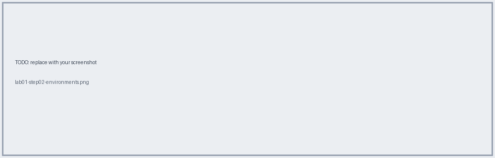
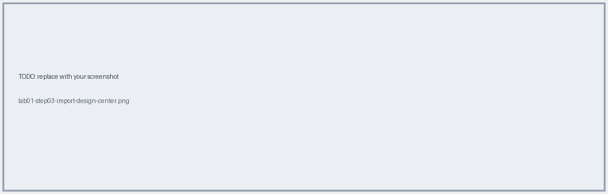
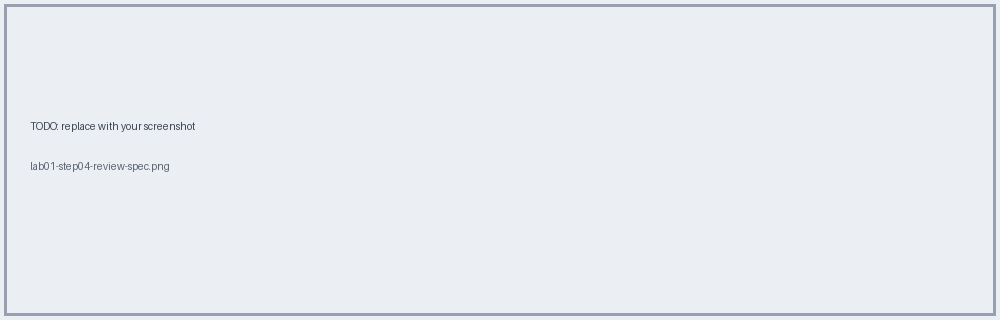
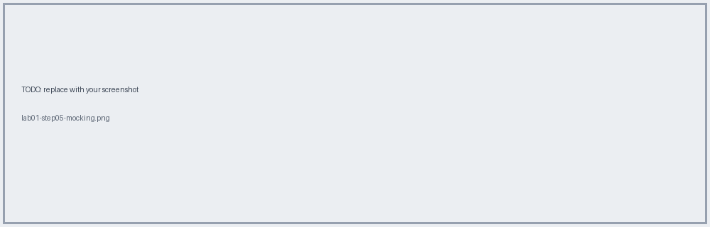
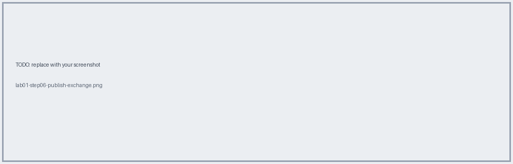

# Lab 01 · Export, Import & Publish the Check-In PAPI Spec

📖 **Read first:** [03 Design-First](../concepts/03-design-first-raml-oas.md) · [04 Exchange](../concepts/04-exchange-mocking.md)
🎯 **End state:** spec published in Exchange as a REST API asset; dev/test/prod environments exist.

## Steps

### 1. Export the spec (OAS) from the AnyAirline public developer portal

- [ ] Downloaded file: `________`

### 2. Create environments (Access Management → Environments)
Create `dev`, `test`, `prod`.

- [ ] Done

### 3. Import into Design Center
New API specification → **Import** → choose the OAS file. Name: `Check-In PAPI`.


### 4. Review the spec
Confirm resource `PUT /tickets/{PNR}/checkin`, types, examples.


### 5. (Optional) Try the Mocking Service
Enable mocking, call the mock URL with curl:
```bash
curl -X PUT "<mock-url>/tickets/ABC123/checkin" -H "Content-Type: application/json"
```


### 6. Publish to Exchange
Publish → set version `1.0.0` → **Publish to Exchange**.


## ✅ Verify
- Asset visible in Exchange, type **REST API**, visibility private.
- Version listed; API Console works.

## 🧠 Self-check
1. Why mock before building?
2. What's the difference between patch and minor version here?

**Next →** [Lab 02](lab-02-api-instance-policy.md)
