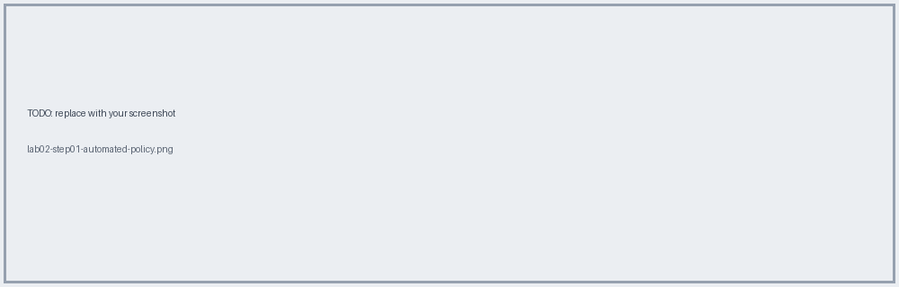
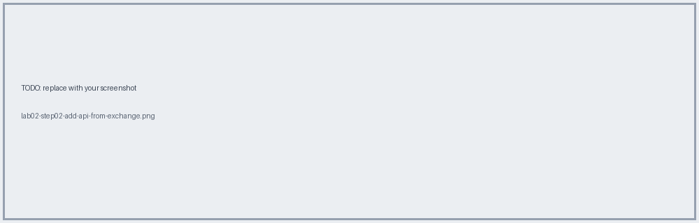
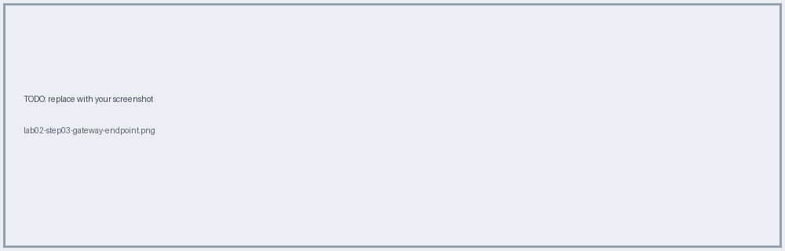
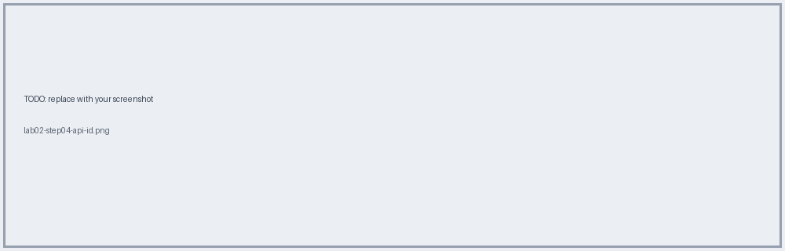
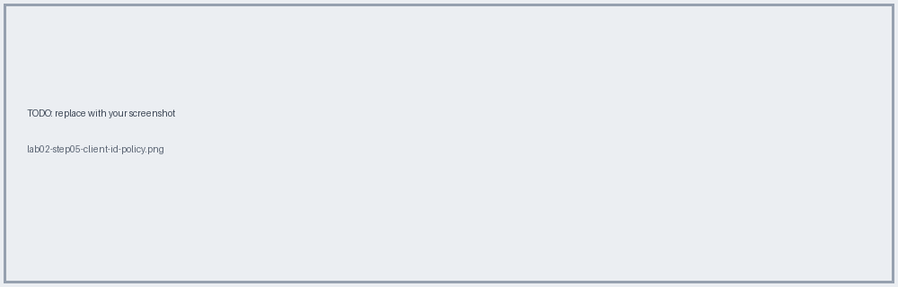

# Lab 02 · Create the API Instance & Apply a Logging Policy

📖 **Read first:** [05 API Manager & Policies](../concepts/05-api-manager-policies.md)
🎯 **End state:** API instance in API Manager (dev) with an automated logging policy; API ID recorded for autodiscovery.

## Steps

### 1. Add an **automated policy** (Message Logging)
API Manager → Automated Policies → Add. Applies to every managed API in the env.

### 2. Add API → From Exchange
Select `Check-In PAPI` 1.0.x.

### 3. Choose runtime and endpoint type
- Runtime: **Mule Gateway**
- Implementation: **Basic endpoint** (Mule app implements it, so no proxy)

### 4. Save → note the **API ID**
- [ ] API ID (dev): `________` (store in `config-dev.yaml`, not in git if sensitive)

### 5. (Optional) Add **Client ID Enforcement** to the checkin resource only
Shows off resource-level policy scope.

## ✅ Verify
Status is **Unregistered** (app not deployed yet). It becomes **Active** in [Lab 07](lab-07-deploy-cloudhub.md).

## 🧠 Self-check
1. Why is a proxy not needed here?
2. Which policy scope is resource-level?

**Next →** [Lab 03](lab-03-implement-apikit.md)
