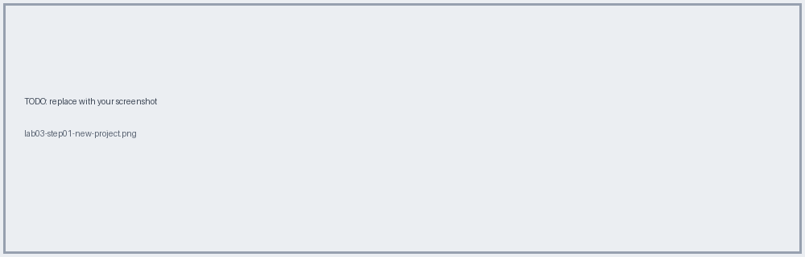
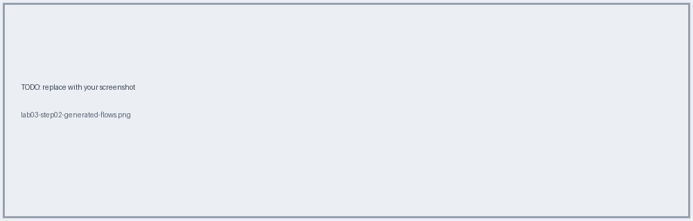
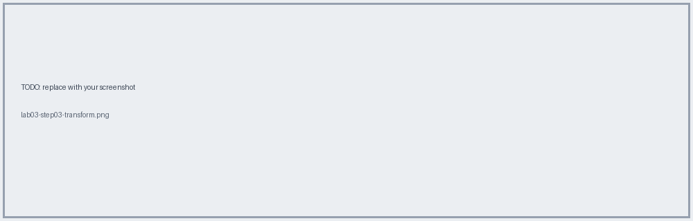
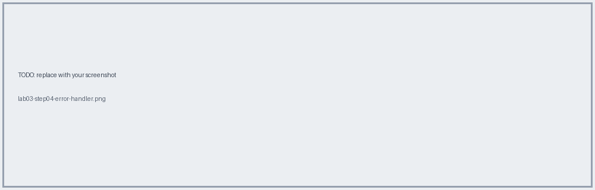
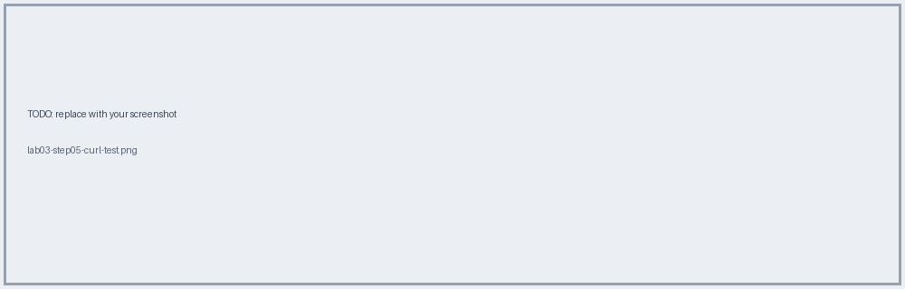

# Lab 03 · Implement the API in Studio with APIkit

📖 **Read first:** [10 APIkit](../concepts/10-apikit-flow-design.md) · [11 DataWeave](../concepts/11-dataweave-basics.md) · [12 Error Handling](../concepts/12-error-handling.md)
🎯 **End state:** Mule app scaffolded from Exchange spec, returns a mocked-logic response locally.

## Steps

### 1. New Mule project from Exchange spec
Studio → File → New → Mule Project → **Import API from Exchange** → `Check-In PAPI`.


### 2. Inspect generated flows
`check-in-papi-main`, `check-in-papi-console`, `put:\tickets\(PNR)\checkin:...`


### 3. Implement the operation (start simple)
Replace the placeholder with the DataWeave from `samples/dataweave/checkin-response.dwl`.


### 4. Add error handlers in the main flow
Use `samples/mule/error-handler.xml`.


### 5. Run locally & test
```bash
curl -i -X PUT http://localhost:8081/api/tickets/ABC123/checkin -H "Content-Type: application/json" -d '{}'
curl -i http://localhost:8081/api/unknown       # expect 404
```


## ✅ Verify
200 with JSON, 404 for unknown path, 405 for wrong method.

## 🧠 Self-check
1. Which flow does autodiscovery point at?
2. What does APIkit validate before your flow runs?

**Next →** [Lab 04](lab-04-keystore-https.md)
