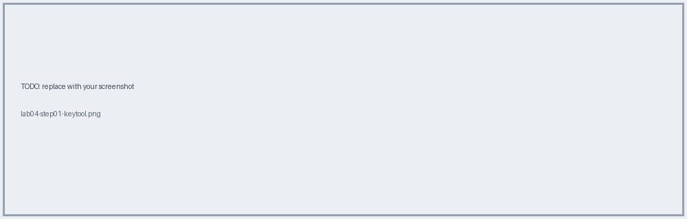
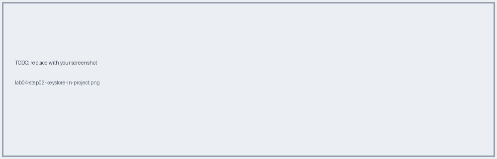
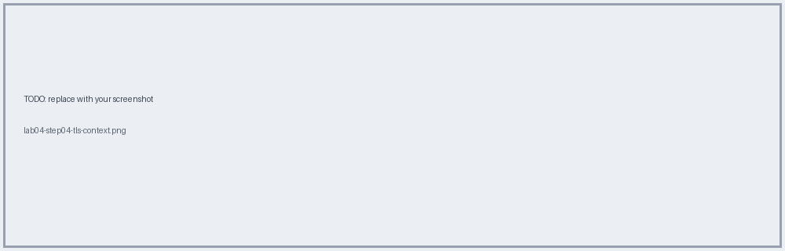
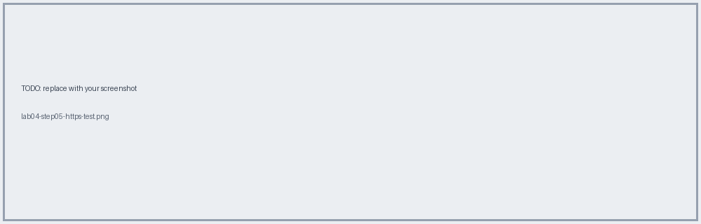

# Lab 04 · Generate a Keystore & Expose HTTPS

📖 **Read first:** [09 TLS & Certificates](../concepts/09-tls-certificates.md)
🎯 **End state:** app answers over HTTPS on `${https.port}` using a self-signed PKCS#12 keystore.

## Steps

### 1. Generate keystore with keytool
```bash
keytool -v -genkeypair -keyalg RSA \
  -dname "CN=localhost, OU=Training, O=MuleSoft, C=US" \
  -ext "SAN=DNS:localhost,IP:127.0.0.1" \
  -validity 365 -alias server \
  -keystore check-in-papi-dev.p12 -storetype pkcs12 \
  -storepass "<choose-a-password>"
```
| Flag | Meaning |
|---|---|
| `-genkeypair` | key pair + self-signed cert |
| `-keyalg RSA` | algorithm |
| `-dname` | subject; CN must match host |
| `-ext SAN` | alternative names clients validate |
| `-validity 365` | days until expiry |
| `-alias` | entry name in keystore |
| `-storetype pkcs12` | modern format (not legacy JKS) |



> Don't use the sample password from slides. Never commit real ones.

### 2. Put keystore in `src/main/resources`


### 3. Inspect it
```bash
keytool -list -v -keystore check-in-papi-dev.p12 -storetype pkcs12
```


### 4. Configure TLS context + HTTPS listener
Use `samples/mule/https-listener.xml`.


### 5. Test
```bash
curl -k -i -X PUT https://localhost:8082/api/tickets/ABC123/checkin
```
`-k` is needed because the cert is self-signed. Without it curl reports an untrusted cert (this is exactly the validation-chain concept).


## ✅ Verify
Works with `-k`; fails without it with a certificate error.

## 🧠 Self-check
1. Keystore vs truststore?
2. Why bind to `${https.port}`, not 8082?

**Next →** [Lab 05](lab-05-autodiscovery-secure-props.md)
