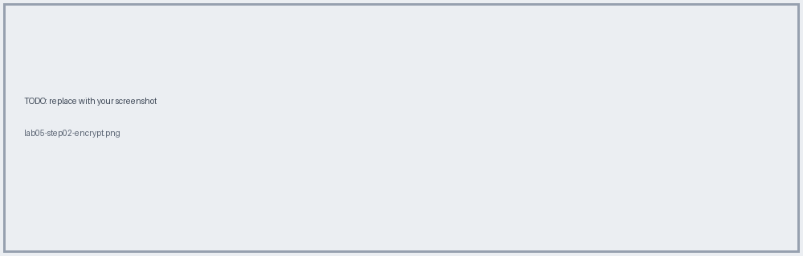
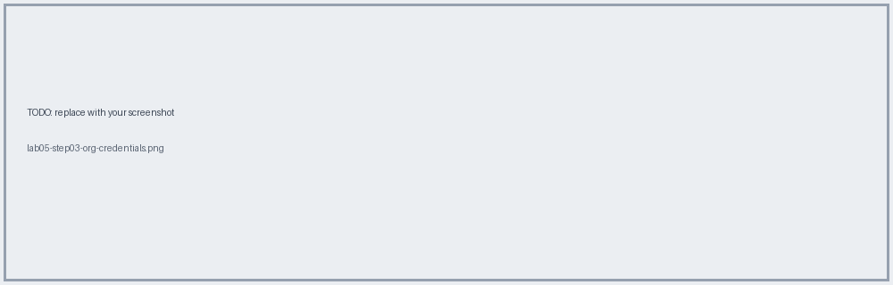
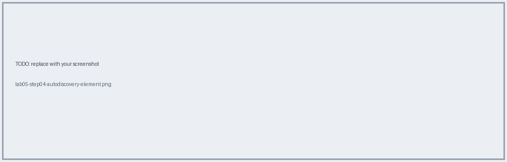

# Lab 05 · Autodiscovery + Secure Properties

📖 **Read first:** [13 Properties & Secrets](../concepts/13-properties-secrets.md) · [06 Autodiscovery](../concepts/06-autodiscovery.md)
🎯 **End state:** secrets encrypted, per-env files, autodiscovery configured.

## Steps

### 1. Create env property files
`config-dev.yaml` from `samples/config/config-dev.yaml`.

### 2. Add Secure Properties module and encrypt secrets
Encrypt keystore password and client secret.

### 3. Get org credentials
Access Management → Environments → dev → Client ID / Secret.

### 4. Add Autodiscovery global element
`apiId=${api.id}`, `flowRef=check-in-papi-main`.

### 5. Run with `-M-Dmule.env=dev -M-Dmule.key=<key>`

## ✅ Verify
Log shows autodiscovery registering; API Manager shows the instance as **Active** once reachable.

## 🧠 Self-check
1. Why one set of credentials per environment?
2. What happens if `flowRef` is wrong?

**Next →** [Lab 06](lab-06-munit.md)
