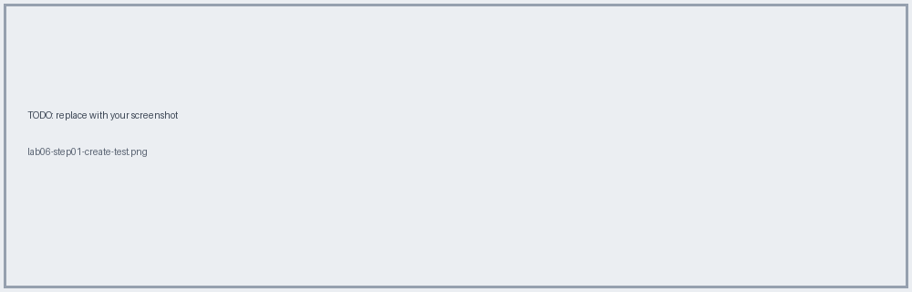
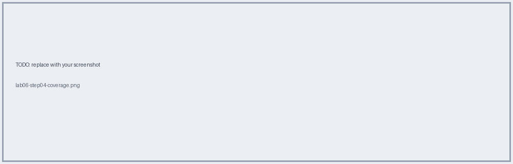

# Lab 06 · MUnit Tests

📖 **Read first:** [14 MUnit](../concepts/14-munit-testing.md)
🎯 **End state:** happy-path and error tests pass, coverage report generated.

## Steps
### 1. Create MUnit suite for the checkin flow
Right-click flow → **MUnit → Create blank test**.

### 2. Add behavior / execution / validation
Use `samples/munit/checkin-test.xml`.

### 3. Add error tests (404, 503)

### 4. Run with coverage

## ✅ Verify
All green; coverage meets your threshold.

**Next →** [Lab 07](lab-07-deploy-cloudhub.md)
