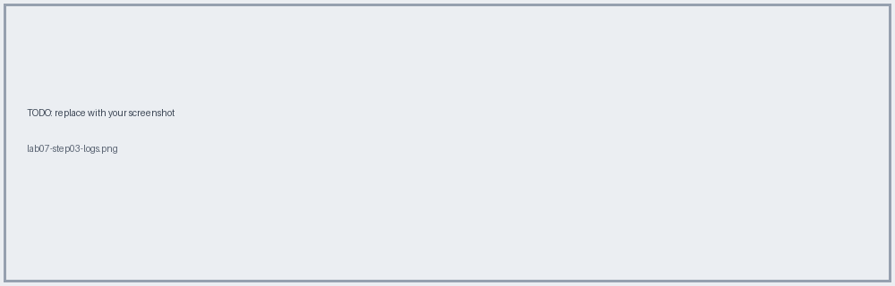
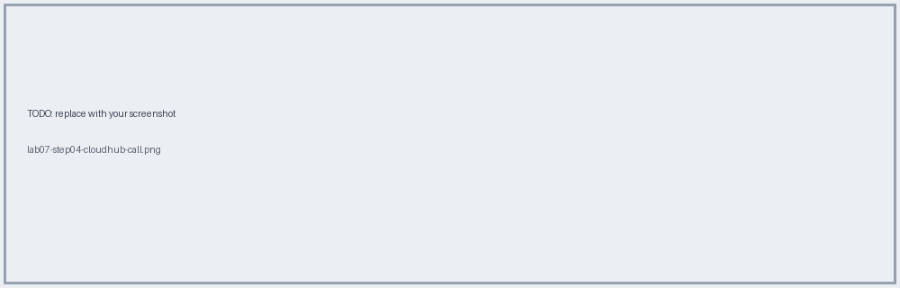
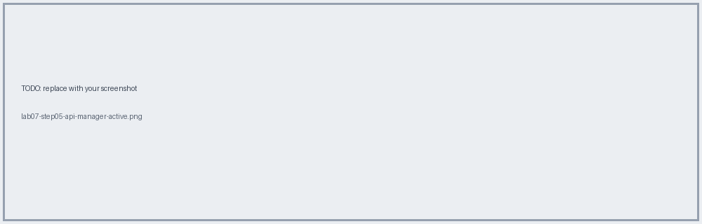
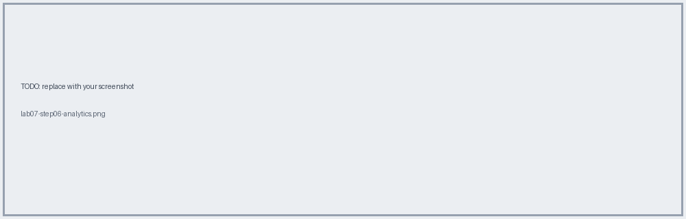

# Lab 07 · Deploy to CloudHub

📖 **Read first:** [15 Deploy & Operate](../concepts/15-deploy-operate.md) · [07 Networking](../concepts/07-networking-cloudhub.md)
🎯 **End state:** app reachable through the shared LB; policies enforced.

## Steps
### 1. Deploy from Studio (manual) to `dev`

### 2. Set properties in Runtime Manager
`mule.env=dev`, `mule.key=<secure>`, `anypoint.platform.client_id/secret`, `api.id`.

### 3. Watch logs → app started, autodiscovery OK

### 4. Call via LB
```bash
curl -i -X PUT https://<app>.<region>.cloudhub.io/api/tickets/ABC123/checkin
```

### 5. Check API Manager: Active + policies

### 6. Check Analytics


## ✅ Verify
Client-ID policy returns 401 without credentials, 200 with.

**Next →** [Lab 08](lab-08-network-tls-checks.md)
