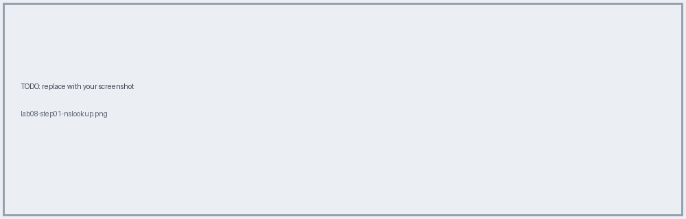
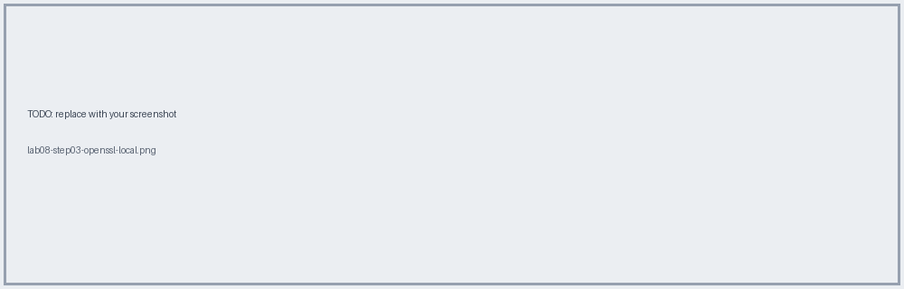

# Lab 08 · Networking & TLS Inspection (Hands-on Commands)

📖 **Read first:** [07 Networking](../concepts/07-networking-cloudhub.md) · [08 VPC & On-Prem](../concepts/08-vpc-onprem-targets.md)
🎯 **End state:** you can *see* DNS, LB, and certificate behaviour yourself.

### 1. DNS resolves to the load balancer, not a worker
```bash
nslookup <app>.<region>.cloudhub.io
nslookup mule-worker-<app>.<region>.cloudhub.io
```


### 2. Inspect the certificate at hop 1
```bash
openssl s_client -connect <app>.<region>.cloudhub.io:443 -servername <app>.<region>.cloudhub.io </dev/null | openssl x509 -noout -issuer -subject -dates
```
Issuer = MuleSoft-managed (SLB).


### 3. Inspect your local self-signed cert
```bash
openssl s_client -connect localhost:8082 </dev/null | openssl x509 -noout -issuer -subject -dates
```
Issuer = subject (self-signed).


### 4. Paper exercise
Fill your table:
| Env | LB | VPC CIDR | On-prem path |
|---|---|---|---|
| dev |  |  |  |
| prod |  |  |  |

**Next →** [Lab 09](lab-09-mutual-tls.md)
