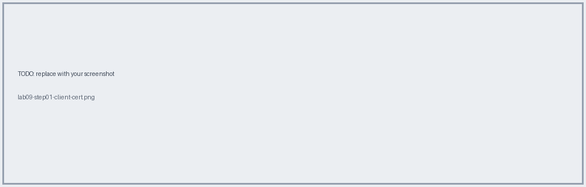
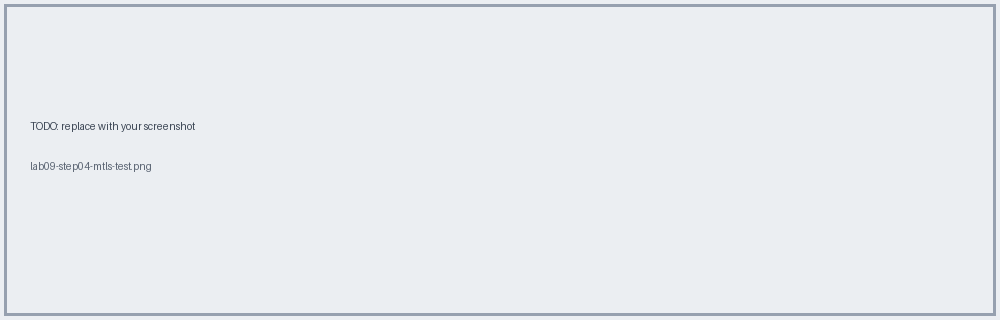

# Lab 09 · Mutual TLS Locally (simulates Flights Management)

📖 **Read first:** [09 TLS](../concepts/09-tls-certificates.md)
🎯 **End state:** listener that *requires* a client certificate.

### 1. Create client keystore + export cert
```bash
keytool -genkeypair -keyalg RSA -alias client -dname "CN=mobile-client, O=AnyAirline" -validity 365 -keystore client.p12 -storetype pkcs12 -storepass "<pw>"
keytool -exportcert -alias client -keystore client.p12 -storetype pkcs12 -storepass "<pw>" -rfc -file client.crt
```


### 2. Import client cert into the server truststore
```bash
keytool -importcert -alias client -file client.crt -keystore truststore.p12 -storetype pkcs12 -storepass "<pw>" -noprompt
```


### 3. Add the truststore to the listener TLS context (enables client-cert validation)
See `samples/mule/mutual-tls.xml`.


### 4. Test with and without the client cert
```bash
# fails: no client cert
curl -k -i https://localhost:8082/api/tickets/ABC123/checkin -X PUT
# works
openssl pkcs12 -in client.p12 -nodes -out client.pem
curl -k --cert client.pem -i https://localhost:8082/api/tickets/ABC123/checkin -X PUT
```


## ✅ Verify
No cert → handshake failure; with cert → 200.

**Next →** [Lab 10](lab-10-cloudhub1-custom-domain.md)
